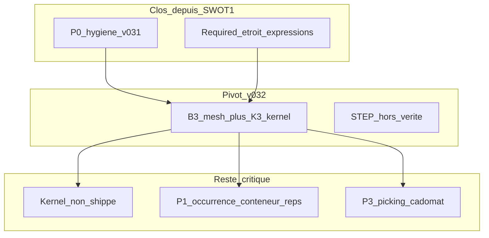
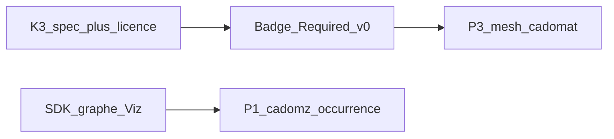

# Rapport SWOT expert — spécifications CADOM (renouvellement)

**Statut :** document de process (non normatif) — **analyse courante**  
**Date :** 2026-09-15  
**Issue :** [#53](https://github.com/naanouff/OpenCAD/issues/53)  
**Révision :** SWOT-2 (remplace les conclusions de SWOT-1 là où elles conflictent)  
**Doctrine produit (prime) :** [`opencad-doctrine.md`](opencad-doctrine.md) — B + B3 + K3  
**Périmètre lu :** CADOM **v0.3.2** (`version_minor = 5`), cadompart **v0.2.2**, cadomesh / cadomat / cadometa v0, `cadom.proto`, amendements v0.3.1 / v0.3.2, freeze native assets, [`sprint-kernel-k3.md`](sprint-kernel-k3.md)  
**SWOT-1 (historique) :** issue [#47](https://github.com/naanouff/OpenCAD/issues/47), merge #48 — utile comme scorecard, **plus comme contrat produit**  
**Référentiels :** CATIA V5 / 3DEXPERIENCE, Creo, NX, JT, 3DXML, USD, STEP AP242, glTF 2.0, Open CASCADE / FreeCAD

Ce document n’est **pas** un contrat de format. Les specs normatives restent en anglais sous [`documentation/specification/`](specification/README.md).

---

## 0. Ce qui a changé depuis SWOT-1

Deux sprints spec ont suivi l’analyse #47 :

| Vague | Issue | Effet |
|-------|-------|--------|
| **v0.3.1 hygiene** | [#49](https://github.com/naanouff/OpenCAD/issues/49) | Presque tout le **P0** SWOT-1 : identité à deux couches, mm/pouces, ordre des frères, `default_active_layers`, hash d’asset, MIME, politique float32/double, rôle `EXACT` |
| **v0.3.2 doctrine** | [#51](https://github.com/naanouff/OpenCAD/issues/51) | **Pivot produit.** OpenCAD n’est plus « JT-web sans kernel ». Orchestration **et** rebuild sont **co-primaires**. Vérité exacte = **cadompart + OpenCAD Kernel**. Viz sans kernel = **cadomesh**. STEP/`EXACT` **hors** modèle de vérité |

SWOT-1 recommandait : *un `.cadom` visualisable sans kernel ; STEP = vérité pour qui ne rebuild pas*.  
La doctrine **tranche autrement** : plateforme CAO (formats + toolchain), kernel produit obligatoire pour Design/Complete, pas de B-Rep persisté (B3), STEP interdit comme vérité.

Ce renouvellement **n’essaie pas de rouvrir STEP**. Il évalue si le nouveau contrat tient industriellement, et ce qui reste dangereux.

---

## 1. Synthèse exécutive

### Verdict (septembre 2026, post-doctrine)

Les **spécifications d’orchestration** sont passées d’un brouillon contradictoire à un **contrat lisible**. Le P0 hygiène a été exécuté avec discipline (unités, ordre BOM, calques par défaut, intégrité d’asset, MIME, profils writer mm/Z-up). cadompart a **resserré** le Required et **interdit** les expressions zombies. C’est du travail de standard.

Le **risque n°1 a changé de nature.** Ce n’est plus « cadompart se prend pour CATIA ». C’est : **Complete OpenCAD = kernel qui n’existe pas encore.** La doctrine a volontairement rendu le kernel *co-primaire*. Tant que le badge **OpenCAD Kernel Required v0** (extrude / revolve / hole / boolean + tessellation → cadomesh) n’est pas vert, le fil rouge est une **promesse de plateforme**, pas un produit.

Le **risque n°2** est B3 : **pas de fichier exact persisté** (ni STEP, ni B-Rep natif). CATIA peut s’offrir ça parce que CGM + CATPart *sont* le produit, partout. OpenCAD, sans kernel chez le fournisseur / le bureau d’études / l’archivage légal, ne livre que du **mesh**. C’est acceptable pour un viewer web. C’est insuffisant pour FAO, métrologie, collision envelope juridique, échange OEM VDA — sauf à documenter un **pipeline d’import** (STEP → recette ou mesh) et, plus tard, un snapshot B-Rep optionnel (**B2** évoqué dans le backlog kernel, hors badge Required).

### Cinq décisions déjà prises (ne plus débattre)

1. OpenCAD = **plateforme** (graphe + rebuild), pas seulement un format d’échange.  
2. Vérité design = **cadompart** ; vérité solide runtime = **kernel** ; viz sans kernel = **cadomesh**.  
3. STEP/AP242 **n’est pas** la vérité OpenCAD (enums proto conservés pour round-trip legacy).  
4. Required rebuild **étroit** + TDD goldens ; catalogue §8 = vocabulaire d’échange, pas un claim CATIA.  
5. `default_active_layers`, ordre des frères, mm/inches, hash : **dans le fil**.

### Cinq décisions encore ouvertes (ce SWOT)

1. **Ship the kernel** (K3-0 spec stub → K3-1 licence → goldens) **avant** d’élargir le catalogue.  
2. **Versionner le tessellateur** sur `.cadomesh` (quel kernel, quelle tolérance a produit le mesh).  
3. **Pipeline d’import** STEP/JT/glTF : ingestion outil, jamais vérité — sinon les OEM n’ont pas de porte d’entrée.  
4. **P1 assemblage** : occurrence PLM, `.cadomz`, multi-représentations (DMU).  
5. **Ne pas** vendre « exact » tant que le badge Required n’a pas de corpus public.

### Fil rouge (aligné doctrine, formulation expert)

> OpenCAD est une plateforme : le graphe `.cadom` orchestre ; `.cadompart` porte l’intent ; le **OpenCAD Kernel** produit le solide ; `.cadomesh` est la vue sans kernel.  
> Un graphe seul **MAY** être valide. Un produit **Complete** sans kernel shippé est une spec, pas un CAD.  
> STEP reste un **sas d’import** possible, jamais une source de vérité normative.

---

## 2. Scorecard SWOT-1 → état v0.3.2

Légende : **Clos** · **Clos puis transféré** · **Supersédé par doctrine** · **Ouvert**

### P0 hygiène

| Reco SWOT-1 | Statut | Preuve |
|-------------|--------|--------|
| P0.1 Réécrire §1 deux couches | **Clos puis transféré** | §1 v0.3.1 puis **co-primaire** v0.3.2 |
| P0.2 Nom de fichier / package proto | **Clos** | En-tête : filename historical ; `cadom.v0_1` frozen |
| P0.3 Table §4.2 `kind` + amendement TBD | **Clos** | §4.2 liste native ; v0.3.2 documente le pivot |
| P0.4 mm / inches assemblage + cadomesh | **Clos** | `LengthUnit` cadom + cadomesh |
| P0.5 Politique précision float32 / double | **Clos** (doc) / **ouvert** (stockage) | §2.3.1 ; mat4 toujours float32 |
| P0.6 Ordre des frères = `nodes[]` | **Clos** | §3.5 normatif |
| P0.7 Rôle `EXACT` pour STEP | **Clos puis supersédé** | Enum conservé ; writers **MUST NOT** s’en servir comme vérité |
| P0.8 `content_sha256` / `byte_length` | **Clos** | `Asset` proto |
| P0.9 `default_active_layers` | **Clos** | `CadomFile` field 10 ; doctrine §4 le garde |
| P0.10 MIME / magic | **Clos** (MIME) / **ouvert** (magic) | `application/vnd.opencad.cadom` ; framing brut |

### P1 assemblage

| Reco | Statut |
|------|--------|
| P1.1 Occurrence PLM | **Ouvert** |
| P1.2 Multi-représentations MESH | **Ouvert** (toujours « at most one per role ») |
| P1.3 Conteneur `.cadomz` | **Ouvert** (non-goal §1.3 n°3) |
| P1.4 Overrides suppress / couleur / représentation | **Ouvert** |
| P1.5 Profil writer Z-up / mm | **Partiel** — §2.1 tableaux ; cadompart §3 défaut encore m / Y-up |
| P1.6 Clés `opencad.*` cadometa | **Ouvert** |
| P1.7 Mates en Extension | **Ouvert** (cadompart §1.2 le dit encore) |

### P2 cadompart

| Reco | Statut |
|------|--------|
| P2.1 Vérité sans rebuild = STEP et/ou mesh | **Supersédé** — viz = cadomesh seulement ; exact = kernel |
| P2.2 Sélecteurs géométriques fillet | **Ouvert** (§10 item 4, après kernel) |
| P2.3 Required étroit | **Clos** (§11.2) |
| P2.4 Interdire `expression` | **Clos** (§4.1) |
| P2.5 Moteur de référence OCCT | **Transféré** — contrat = **OpenCAD Kernel** ; OCCT = bootstrap **MAY** |
| P2.6 Configurations | **Conservé** |

### P3 viz

| Reco | Statut |
|------|--------|
| P3.1 Groupes face/body + LOD | **Ouvert** |
| P3.2 Défauts cadomat CAO | **Ouvert** (toujours metallic=1, roughness=1) |
| P3.3 Unités cadomesh mm | **Clos** (proto) |
| P3.4 PMI | **Ouvert** — doctrine : faces mesh/kernel, **pas** AP242-as-truth |

**Lecture.** Le backlog [`sprint-swot-remediation.md`](sprint-swot-remediation.md) est juste sur P1/P3. Il sous-estime le nouveau P0 : **le kernel**.

---

## 3. Grille de comparaison (contrat actuel)

| Capacité | CATIA / 3DX | NX | JT | 3DXML | STEP AP242 | glTF | OpenCAD v0.3.2 |
|----------|-------------|----|----|-------|------------|------|----------------|
| Graphe | Product | Assembly | Structure | XML | Product | Nodes | DAG UUID + ordre frères |
| Occurrence PLM | Fort | Fort | Attributs | Instance | AP242 | Faible | **Toujours faible** (`name` seul) |
| Exact persisté | CATPart / CGM | PRT / Parasolid | XT optionnel | CATPart possible | **Cœur** | Non | **Non (B3)** — solide = kernel live |
| Feature history | Propriétaire | Propriétaire | Non | Non | Non | Non | cadompart + **un** kernel produit |
| Viz sans kernel | CGR | JT / vis | **Cœur** | CGR | Tessellation | **Cœur** | cadomesh / glTF |
| Conteneur | 3DXML | JT | Mono-fichier | Zip | STEP+ | GLB | **Absent** |
| Unités atelier | mm, double | mm, double | mm/m | mm | mm | m Y-up | mm **et** m ; float32 disque |
| Calque par défaut | Visus | Arrangements | — | Partiel | — | — | **`default_active_layers`** |
| Pass-through | Limité | Props | Properties | User attrs | User-defined | extras | **Fort** |
| Cible | Authoring PLM | Authoring PLM | OEM viz | Échange 3DX | Exact ISO | GPU | **Plateforme** (spec) / viz (sans kernel) |

**Lecture.** OpenCAD a **rattrapé** JT/3DXML sur le graphe (ordre, calques, hash, MIME). Il a **choisi** le camp authoring (kernel) **sans** encore le livrer, et **sans** snapshot exact — position plus risquée que SWOT-1, potentiellement plus différenciante si K3 existe.

---

## 4. SWOT (état courant)

*Note IDs :* les numéros `W` / `O` / `T` conservent la numérotation SWOT-1 quand l’item est toujours ouvert. Les trous (ex. W1–W2, W5–W6, O1–O2, T2, T7) correspondent à des items **clos ou supersédés** (voir scorecard §2), pas à des oublis.

### 4.1 Forces

| ID | Force | Preuve | Pourquoi ça tient |
|----|--------|--------|-------------------|
| S1 | Identité produit écrite | Doctrine §1–3 ; CADOM §1.1 ; README racine | Plus de crise « JT ou CATIA ». Les partenaires savent que Complete = graphe + recette + mesh + kernel. |
| S2 | Graphe plat UUID, instancing, late load | §3, §4.5–4.6 | Inchangé, toujours le bon étage web / DMU léger. |
| S3 | Bindings MESH + PARAMETRIC | §3.3.1 règle 6 SHOULD | CGR + CATPart mental model, sans STEP dans la boucle de vérité. |
| S4 | Pass-through + Protobuf + RFC 2119 | §6, §8 | Inchangé. |
| S5 | Hygiène filaire v0.3.1 | mm, hash, MIME, sibling order, default layers, §2.3.1 | Un OEM peut ouvrir la spec sans tomber sur des contradictions de table `kind`. |
| S6 | Required rebuild **étroit** + TDD | cadompart §11.2 ; doctrine §4 ; sprint K3 | La seule façon honnête de viser un kernel. SWOT-1 l’avait exigé ; c’est dans le contrat. |
| S7 | Expressions interdites | cadompart §4.1 | Plus de champ zombie présenté comme paramétrique. |
| S8 | STEP hors vérité | Doctrine §2 ; proto commentaires LEGACY | Évite de concurrencer AP242 et de mélanger tessellation et B-Rep ISO. |
| S9 | Profils Graph / Viz / Design / Complete | Doctrine §2 | Permet un SDK graphe **sans** mentir sur Complete. |
| S10 | Split double (part) / float32 (assemblage viz) | cadompart `Vec3` double ; §2.3.1 | Politique désormais **écrite**. |
| S11 | Kernel nommé produit, pas « bring your own » | cadompart §11.4 | Évite le piège FreeCAD « ça rebuild chez moi ». Un format + **un** moteur. |

### 4.2 Faiblesses

| ID | Faiblesse | Preuve | Impact | Reco |
|----|----------|--------|--------|------|
| W-K | **Kernel = spec + backlog, zéro badge** | [`sprint-kernel-k3.md`](sprint-kernel-k3.md) : K3-0…K3-7 « suggested » ; freeze native : engine « separate sprint » | Complete est indémontrable. Toute démo « exact » sans goldens est du marketing | **P0-K** |
| W-B3 | **Pas d’exact persisté** | Doctrine B3 ; cadompart §1.3 | Fournisseur sans binaire kernel : mesh only. FAO / métrologie / archive légale : trou | P0-K + import ; B2 (backlog kernel) plus tard |
| W3 | Occurrence PLM absente | `Node` sans `part_number` / `revision` / `definition_id` | BOM, dash numbers, interchangeabilité | P1.1 |
| W4 | Mates absents | cadompart §1.2 | Intent d’assemblage = mat4 cuit | P1.7 |
| W7 | Un MESH par nœud | §3.3.1 règle 3 | Pas de DESIGN / VIZ / envelope (DMU auto/aéro) | P1.2 |
| W9 | float32 toujours on-disk | §2.3 encore binary32 | Politique écrite ≠ précision atelier | P1 (f64 optionnel) |
| W11 | Pas de conteneur | §1.3 n°3 | 5 fichiers, URI cassées | P1.3 |
| W12 | Solveur 2D + IDs topologiques toujours kernel-local | cadompart §6, §10 | Sans K3-5/K3-6, même le Required peut diverger | P0-K |
| W13 | cadomesh sans faces / bodies / LOD | cadomesh §4 | Pas de picking PMI, pas de LOD atelier | P3.1 |
| W14 | cadomat chrome | cadomat §3 metallic=1 roughness=1 | Import « pièce rouge » = bille métal | P3.2 |
| W15 | cadometa sans clés réservées | cadometa §8 | PLM lite = JSON | P1.6 |
| W16 | Overrides toujours vis / mat / xform | §5.2 | Pas de suppress / couleur instance / purpose | P1.4 |
| W19 | **Enums STEP/EXACT encore dans le proto** | `cadom.proto` | Six mois de « on a un rôle EXACT » vs « MUST NOT » | Doc SDK + lints writers |
| W20 | **cadompart défaut m / Y-up** | cadompart §3 | Contredit le profil CATIA §2.1 du graphe | P1.5b |
| W21 | Freeze native assets **stale** | freeze : cadompart « v0.2 » ; deferred « rebuild engine separate » sans pointer K3 | Lecteurs du freeze ratent la doctrine | Hygiene process |
| W22 | §8 / changelog encore marketing « industrial / exhaustive » | cadompart §8 Recommended + changelog 0.2 « Exhaustive… » (titre déjà v0.2.2 doctrine) | Un OEM skimme §8 et ignore §11.2 | P2-comm |
| W23 | **Versioning 0.x dense** | v0.3 → 0.3.1 → 0.3.2 + cadompart 0.2.1 → 0.2.2 le même jour | `EXACT` ajouté puis retiré de la vérité en une journée | Geler le fil rouge ; kernel ensuite |
| W24 | Pas de stamp kernel sur le mesh | cadomesh : positions only | Impossible de savoir si le CGR est stale vs recette | P0-K tessellation metadata |

### 4.3 Opportunités

| ID | Opportunité | Comment |
|----|-------------|---------|
| O-K | **Être le premier format web + kernel nommé** | JT n’a pas d’arbre. FreeCAD n’a pas de graphe Protobuf d’assemblage. Si Required goldens existent, la doctrine devient un avantage. |
| O-imp | Import STEP comme **sas**, pas vérité | Outil : STEP → cadomesh (toujours) ; STEP → cadompart (best-effort, plus tard). Norme : ne jamais écrire `AssetKind.STEP` comme vérité. |
| O-ver | `tessellator` + `kernel_version` sur cadomesh | Comme un CGR qui sait de quel CATIA il vient. |
| O3 | Représentations nommées | DMU : viz / envelope / design mesh. |
| O4 | `.cadomz` | Recette 3DXML/USDZ, maintenant que le graphe est propre. |
| O8 | Mates en `com.opencad.assembly_constraints.v1` | Toujours le bon ordre KHR. |
| O9 | w3dts = validateur **Viz** ; kernel = validateur **Design** | Deux badges, deux CI. |

### 4.4 Menaces

| ID | Menace | Pourquoi c’est plus vrai qu’en SWOT-1 | Mitigation |
|----|--------|--------------------------------------|------------|
| T-K | **Kernel vaporware = doctrine à vide** | SWOT-1 disait : ne pas faire dépendre l’assemblage du rebuild. La doctrine **l’a fait** pour Complete. | Badge Required **avant** toute comm « CAD platform exact ». SDK graphe OK en parallèle (profil Graph/Viz). |
| T1 | OEM vivent encore de JT+STEP | VDA, Airbus, NASA, sous-traitance | Import sas + mesh. Ne pas prétendre remplacer AP242. |
| T3 | PLM sans occurrence | Inchangé | P1.1 / P1.6 |
| T4 | Round-trip fillet | Inchangé, mais **moins urgent** : Required ne contient pas fillet | Ne pas élargir §11.3 avant K3-6 |
| T5 | Instabilité 0.x | Pivot EXACT en 24 h | Freeze doctrine ; issues kernel, pas de nouveau mineur « philosophie » |
| T6 | Paquet multi-fichiers | Inchangé | P1.3 |
| T-B3 | **« Exact » sans fichier exact** | Un auditeur qualité : « où est le B-Rep ? » Réponse : « dans le process kernel ». Refus fréquent hors de votre runtime | Documenter Completeness : exact = *reproductible par kernel version N* ; mesh = *livrable figé* |
| T-lic | Base kernel (OCCT LGPL vs autre) non choisie | K3-1 ouvert | Trancher **avant** d’écrire l’API publique |
| T8 | Extensions sauvages | Inchangé | 3 profils max |

---

## 5. Analyse par contrat (relecture)

### 5.1 `.cadom` v0.3.2 — orchestration

**Maturité.** Le fichier cœur est **au niveau d’un standard d’échange sérieux** pour un graphe : DAG, rôles, calques par défaut, hash, unités atelier, ordre BOM, MIME. Les contradictions SWOT-1 §5 (table `kind`, non-goal feature history, STEP-as-MESH) sont **closes**.

**Reste atelier.** Occurrence, conteneur, multi-rep, mates, overrides riches — le Product CATIA n’est toujours pas là. Ce n’est plus bloquant pour un **viewer**. Ça le redevient pour un **PLM**.

**Piège proto.** `EXACT` / `STEP` sur le fil + prose MUST NOT = dette pédagogique. Le SDK devra **lint** (warn/fail strict) à l’encode OpenCAD.

### 5.2 `.cadomesh` — viz B3

**Juste.** B3 (mesh = échange sans kernel) est le bon CGR. Unités alignées. Commentaires proto field vs value clarifiés.

**Trou nouveau (post-doctrine).** Si le mesh **est** la vérité viz, il doit porter **la provenance** : kernel id, version, tolérance de tessellation, éventuellement hash du `.cadompart` source. Sinon Complete ne peut pas détecter un CGR périmé après edit paramétrique (quotidien CATIA : update CGR).

Picking / LOD : inchangé, P3.

### 5.3 `.cadompart` v0.2.2 — intent

**Progrès réel.** Required étroit, expressions interdites, « other kernels = best-effort », OpenCAD Kernel nommé, tessellation vers cadomesh dans §11.2. La posture « exhaustive = claim CATIA » est **techniquement** désamorcée si on lit §11.

**Progrès incomplet.** Le titre est aligné doctrine (v0.2.2), mais §8 et le changelog « Exhaustive industrial catalogue » listent encore loft/shell/draft/thread comme couverture industrielle. Un lecteur pressé lira §8. **Déplacer** le catalogue Recommended en annexe, ou un bandeau « not a conformance claim », réduirait T4/W22.

**Défauts d’unités** encore m / Y-up : un writer CATIA qui fait un `.cadom` en mm/Z et un `.cadompart` en m/Y aura deux espaces. Aligner les SHOULD sur §2.1 du graphe.

**Kernel.** §11.4 est de la **prose de gouvernance**, pas une spec kernel (domaines, tolérances, API). C’est K3-0. Tant que K3-0 n’existe pas, cadompart promet un moteur défini ailleurs.

### 5.4 `.cadomat` / `.cadometa`

Inchangés depuis SWOT-1. P3.2 et P1.6 restent les reco justes. La doctrine n’y change rien.

---

## 6. Incohérences prose ↔ proto ↔ process (reste)

Moins nombreuses, **plus localisées** :

1. **Freeze native assets** : cadompart « v0.2 », deferred « conforming rebuild engine » sans lien doctrine/K3.  
2. **cadompart §3** défauts m / Y-up vs CADOM §2.1 profil CATIA mm / Z.  
3. **`AssetRole.EXACT` / `AssetKind.STEP`** présents, vérité interdite — pas d’outil de lint spec-level (OK) mais le SDK devra l’incarner.  
4. **cadompart `version_minor = 2`** pour prose 0.2.2 — documenté, acceptable.  
5. **Magic bytes** toujours absents — assumé §8 ; sniffers = parse proto. Acceptable.  
6. **`material_ref`** toujours string non typée UUID. Mineur.  
7. **Résolu (polish QA) :** la doctrine pointe désormais SWOT-2 comme analyse courante ; elle **prime** toujours sur le produit en cas de conflit.

---

## 7. Préconisations (SWOT-2)

Ne **pas** ré-ouvrir P0.1–P0.10 filaires. Priorité = **faire exister K3**, puis P1/P3 déjà listés.

### P0-K — Kernel (nouveau P0, bloquant Complete)

| Reco | Quoi | Où | Pourquoi |
|------|------|----|----------|
| P0-K.1 | Spec stub `opencad-kernel-v0.md` : identité, versioning, non-goals, lien cadompart §11.2, schéma d’IDs, tolerances **TBD numériques** | nouveau spec + K3-0 | W-K, T-K |
| P0-K.2 | Choisir la base + licence (OCCT wrap vs autre) **par écrit** | K3-1, doctrine §5 item 5 | T-lic |
| P0-K.3 | Badge **Required v0** : goldens extrude → revolve/hole/boolean + sketch contraintes de base **et** tessellation writer (K3-7) | K3-3…K3-5 **et** K3-7 | T-K, S6 |
| P0-K.4 | Métadonnées de tessellation sur cadomesh : `kernel_id`, `kernel_version`, `source_cadompart_id` (ou hash) | cadomesh proto/spec + K3-7 | W24, T-B3 |
| P0-K.5 | Clause **import** : les outils **MAY** lire STEP/JT pour *produire* cadomesh/cadompart ; les writers OpenCAD **MUST NOT** émettre STEP/EXACT comme vérité | doctrine + SDK lint | T1, O-imp, W19 |
| P0-K.6 | Mettre à jour le freeze native assets (pointeur K3, cadompart v0.2.2) | `native-assets-v0-freeze.md` | W21 |

### P1 — Assemblage (inchangé, toujours v0.4)

P1.1 occurrence · P1.2 multi-rep · P1.3 `.cadomz` · P1.4 overrides (`suppressed`, couleur d’instance, purpose) · P1.5 profil writer CADOM §2.1 · P1.5b **défauts cadompart mm/Z SHOULD pour writers mécaniques** · P1.6 clés `opencad.*` · P1.7 mates Extension.

**Option P1.f64 :** `local_transform_f64` optionnel, déjà prévu §2.3.1 — après le kernel, pas avant.

### P2 — cadompart (reste)

| Reco | Quoi |
|------|------|
| P2-comm | Bandeau / annexe : §8 Recommended ≠ claim de rebuild |
| P2.2 | Sélecteurs géométriques **après** K3-6 |
| P2.expr | Dialecte expressions : seulement si un atelier réel le demande |

### P3 — Viz

P3.1 face/body groups + LOD · P3.2 défauts cadomat CAO (metallic 0, roughness ~0.4) · P3.4 PMI plus tard sur ids kernel/mesh.

---

## 8. Roadmap (post-doctrine)

| Track | Contenu | Peut rater si… |
|-------|---------|----------------|
| **SDK Graph/Viz** | decode/encode `.cadom`, pass-through, overrides, lint anti-STEP | On attend le kernel pour parser un graphe |
| **Kernel Required** | P0-K.1–P0-K.6 / K3-0…K3-7 | On élargit fillet/shell « pour la démo » |
| **P1** | Conteneur + occurrence quand on pack des vrais assemblages | Premier zip e-mail casse les URI (T6) |
| **P3** | Picking / apparence CAO | Viewer « chrome + pas de highlight face » |

**Règle.** Profil **Viz** (graphe + cadomesh) peut sortir **sans** kernel. Profil **Design/Complete** **MUST NOT** être annoncé tant que le badge Required n’a pas de corpus public.

---

## 9. Hors-scope (tenu)

Inchangé et **renforcé** par la doctrine :

1. Kernel B-Rep *fichier* natif (B2) — plus tard, pas maintenant.  
2. PMI/GD&T complets.  
3. Class-A, harness, PCB.  
4. Solveur d’assemblage dans le core.  
5. USD-compat.  
6. Catalogue « tout CATIA ».  
7. **Rouvrir STEP comme vérité OpenCAD** — tranché. L’import outil n’est pas une réouverture.

---

## 10. Mapping backlog

| Priorité | Sujet | Issue / piste |
|----------|-------|----------------|
| P0-K | Spec kernel + licence + goldens + stamp mesh | [`sprint-kernel-k3.md`](sprint-kernel-k3.md) |
| P0-K | Lint writers anti-STEP/EXACT + note import | SDK + doctrine |
| P0-K | Freeze native assets aligné | process |
| P1 | [`sprint-swot-remediation.md`](sprint-swot-remediation.md) P1.1–P1.7 | v0.4 |
| P3 | cadomesh groupes ; cadomat défauts | native minors |

---

## 11. Conclusion

SWOT-1 avait raison sur l’**hygiène** et sur le **Required étroit** : c’est fait. Il avait tort — *relative à la décision produit que vous avez ensuite écrite* — de figer OpenCAD comme JT-web : vous avez choisi une **plateforme à kernel**. C’est légitime (FreeCAD + format d’assemblage moderne, ou un CATIA-subset ouvert). Ce n’est tenable que si **K3 devient un artefact**, pas un backlog.

La phrase de vérité, alignée doctrine **et** atelier :

> **CADOM orchestre. cadompart raconte. Le OpenCAD Kernel, versionné, *fait* le solide et rafraîchit le cadomesh. Sans ce binaire, OpenCAD est un très bon graphe de visualisation — et Complete est un mot.**

Les préconisations actionnables ne sont plus « réécrire §1 ». Elles sont : **spécifier et shipper le kernel Required**, tamponner les meshes, lint anti-STEP, puis P1 (`.cadomz`, occurrence) et P3 (apparence / picking).

---

*SWOT-2 — [#53](https://github.com/naanouff/OpenCAD/issues/53). SWOT-1 (#47) conservé dans l’historique git. Doctrine [`opencad-doctrine.md`](opencad-doctrine.md) prime sur tout fil rouge antérieur. Les changements listés en §7 ne sont pas appliqués ici.*
