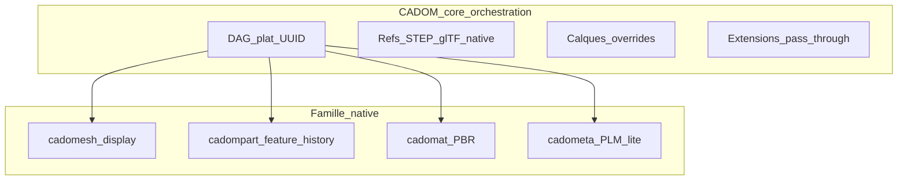
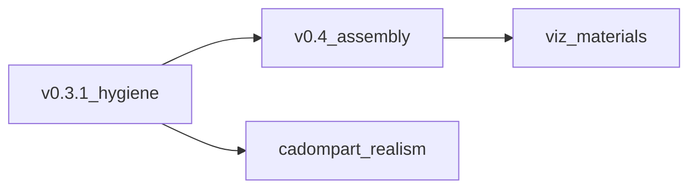

# Rapport SWOT expert — spécifications CADOM

**Statut :** document de process (non normatif) — **analyse historique**  
**Date :** 2026-09-15  
**Issue :** [#47](https://github.com/naanouff/OpenCAD/issues/47)  

> **Doctrine produit (2026-09-15) :** les décisions B + B3 + K3 + « pas de STEP comme vérité OpenCAD » dans [`opencad-doctrine.md`](opencad-doctrine.md) **priment** sur le fil rouge SWOT ci-dessous (JT-web sans kernel). Conserver ce fichier pour le raisonnement et le backlog P1/P3 ; ne pas le traiter comme contrat produit.
**Périmètre lu :** CADOM v0.3 (fichier historique `cadom-v0.1.md`), cadomesh / cadompart v0.2 / cadomat / cadometa v0, freeze native assets, amendements v0.2–v0.3, schémas Protobuf associés  
**Auteur :** revue d’expert CAO industrielle (automobile, aviation, horlogerie) + architecture de formats d’échange  
**Référentiels de comparaison :** CATIA V5 / 3DEXPERIENCE, Creo, NX, JT, 3DXML, USD, STEP AP242, glTF 2.0

Ce document n’est **pas** un contrat de format. Les spécifications normatives restent en anglais sous [`documentation/specification/`](specification/README.md).

---

## 1. Synthèse exécutive

### Verdict

Le **cœur CADOM** (graphe d’assemblage plat à UUID, références d’assets, late tessellation, overrides non destructifs, extensions pass-through, Protobuf) est une architecture **crédible** pour un format d’orchestration d’assemblage web-native. Il se situe dans la lignée utile de **JT (structure)** et **3DXML (manifeste)**, avec un parti pris GPU/web (mat4 column-major, glTF) plus net que ces deux-là.

La **famille native** (cadomesh, cadomat, cadometa) est un complément cohérent **si** on la traite comme des compagnons optionnels, à la manière CGR + propriétés + matériau autour d’un Product.

**`cadompart` v0.2 « catalogue exhaustif + moteur de rebuild conforme » est le risque stratégique n°1.** L’échange d’arbre de features entre CATIA, Creo et NX est un cimetière industriel. STEP AP242 et JT ont **volontairement** évité ce piège : B-Rep / tessellation d’abord, historique paramétrique ensuite (et rarement). Vendre un vocabulaire « exhaustif » sans solveur de sketch, sans dialecte d’expressions, sans sélecteurs topologiques kernel-agnostiques, et sans moteur de référence, expose OpenCAD à un premier round-trip raté (fillet, identifiants d’arêtes) qui **tue la crédibilité** du reste du format.

### Cinq décisions à prendre

1. **Architecture à deux couches, écrite dans §1.** Core = orchestration visualisable **sans kernel**. Native parametric = enrichissement optionnel, jamais condition de validité d’un produit.
2. **STEP n’est pas un mesh.** Introduire un rôle `EXACT` (ou équivalent) distinct de `MESH`.
3. **Un document CADOM doit rester un produit** (arbre + viz + méta) même si cadompart est absent, illisible, ou non rebuildable.
4. **Hygiène spec avant d’élargir le SDK** : contradictions §1.3 / cadompart, table `kind` obsolète, unités mm absentes du proto assemblage, ordre des frères, calque par défaut.
5. **Ne pas spécifier un clone CATIA.** Réduire le Required rebuild à sketch + extrude / revolve / hole / boolean ; STEP (ou B-Rep) = source de vérité géométrique pour les consommateurs sans rebuild.

### Fil rouge

Un document CADOM **doit** rester visualisable et rond-trippable **sans kernel et sans rebuild**. C’est le pattern JT / 3DXML / glTF. Tout ce qui exige un kernel (arbre de features, IDs d’arêtes) est un enrichissement optionnel.

---

## 2. Grille de comparaison industrielle

CADOM n’est comparable à CATIA/Creo/NX **que** sur le contrat de **document d’échange**, pas sur le kernel. Les colonnes utiles sont les formats d’assemblage / visualisation / PLM, pas les ateliers de conception.

| Capacité | CATIA V5 / 3DX | NX | Creo | JT | 3DXML | USD | STEP AP242 | glTF | CADOM v0.3 |
|----------|----------------|----|------|----|-------|-----|------------|------|------------|
| Graphe d’assemblage | Product / instance | Assembly / component | Assembly | Product structure | XML tree | Stage / prims | Product structure | Scene nodes | DAG plat UUID |
| IDs persistants | UUID PLM 3DX | UIDs | Path / feat ids | JT node ids | File refs | SdfPath | Persistent IDs (limité) | Index | UUID texte |
| Occurrence vs définition | Fort (instance + ref) | Fort | Fort | Structure + JT B-Rep | Instance + CATPart | Composition | Occurrence AP242 | Instance mesh | Faible (nœud + asset partagé) |
| Mates / contraintes d’assemblage | Constraints | Assembly constraints | Constraints | Non (posé) | Non | Non (posé / physics ext) | Représentation limitée | Non | **Absent** (mat4 cuit) |
| Représentations (design / viz / envelope) | Design / CGR / visus | Precise / lightweight / JT | Master / simp rep | LOD / tessellation | CGR | Purpose / variants | Tessellation + B-Rep | Mesh runtime | **Un MESH par nœud** |
| Exact B-Rep | CATPart / STEP | Parasolid / STEP | Granite / STEP | XT B-Rep optionnel | CATPart / STEP via 3DX | Non (geom USD) | **Cœur** | Non | Ref STEP (rôle MESH, sémantique fausse) |
| Feature history échangeable | Propriétaire | Propriétaire | Propriétaire | Non | Non | Non | Non (PMI, pas l’arbre) | Non | cadompart (ambition trop haute) |
| Tessellation web | CGR / 3DXML / glTF export | JT / vis | Creo View | **Cœur** | CGR | Hydra | Mesh AP242 | **Cœur** | cadomesh / glTF, late load |
| Calques non destructifs | Filtres / visus / recs | Arrangements | Simp reps / layers | Late delivery | Limité | **Layers USD** | Non | Extras | Overrides (vis/mat/xform seulement) |
| Calque actif dans le fichier | Oui (état de vue) | Arrangements | Simp rep active | Non | Partiel | Session + layer stack | N/A | N/A | **Hors document** |
| Unités | mm (typique), double | mm, double | mm, double | mm / m | mm | cm (convention) | mm typique | m, Y-up | **m, Y-up, float32** |
| Conteneur multi-fichiers | 3DXML, 3DXML+ | JT, zip NX | Non unique | JT mono-fichier | **Zip XML** | USDZ | STEP + sides | GLB / glTF+bin | **Absent** |
| PMI / GD&T | FTA | PMI | Annot | JT PMI | FTA via 3DX | UsdGeom / schemas | **AP242 PMI** | Non | Hors scope (juste) |
| Pass-through vendor | Limité | Attributs | Parameters | Properties | User attrs | Custom schemas | User-defined | extras | **Fort** (opaque bytes) |
| Cible | Authoring PLM | Authoring PLM | Authoring PLM | Viz / OEM | 3DX web/échange | Film / digital twin | Exact / ISO | Runtime GPU | Web + tooling |

**Lecture.** CADOM gagne sur : graphe plat, Protobuf, pass-through, late tessellation, bindings multi-rôles. Il perd (aujourd’hui) sur : occurrence PLM, mates, représentations multiples, unités/précision CAO, conteneur, vérité géométrique STEP clairement séparée du mesh.

---

## 3. SWOT

Chaque item cite un ancrage spec. Les préconisations associées sont en §6.

### 3.1 Forces

| ID | Force | Preuve spec | Pourquoi c’est industriellement juste |
|----|--------|-------------|----------------------------------------|
| S1 | Séparation graphe / géométrie | CADOM §1.1 : CADOM n’est pas un kernel B-Rep/NURBS ; géométrie externe | Même split que JT (structure vs XT) et 3DXML (manifeste vs CGR/CATPart). Permet un viewer web sans kernel. |
| S2 | DAG plat à UUID, lookup O(1) | §3.1–3.2 ; enfants dérivés de `parent_id` | Les assemblages auto (10⁴–10⁵ nœuds) et aéro (10⁶ en BOM étendu) ne supportent pas un XML profond. UUID = ancrage PLM (3DX). |
| S3 | Instancing par asset partagé | §4.7 : plusieurs nœuds **MAY** partager le même Asset id | Équivalent instance CATIA / NX : une définition, N occurrences. Bon réflexe mémoire et cache CDN. |
| S4 | Bindings multi-rôles v0.3 | §3.3.1 : MESH / PARAMETRIC / MATERIAL / METADATA | C’est le modèle 3DX mental : visualisation + recette + apparence + attributs sur **la même occurrence**. |
| S5 | Late tessellation | §4.5–4.6 : graphe valide sans fetch ; asset manquant ≠ document invalide | Pattern 3DEXPERIENCE web, Creo View, Teamcenter Active Workspace. Indispensable. |
| S6 | Overrides non destructifs | §5 : base stable, calques, replace-not-clear | Plus proche d’USD layers / visus CATIA que d’un « bake » type export glTF. |
| S7 | Pass-through bit-for-bit | §6 ; proto `Extension.payload` | Seule façon réaliste d’accueillir cinématique NX, publications CATIA, R&D interne **sans** standardiser trop tôt. |
| S8 | Protobuf + RFC 2119 + proto normatif | §8, `cadom.proto` | Mieux que JSON ad hoc ou XML 3DXML pour multi-langages (TS / C++ / Python plus tard). |
| S9 | Split précision kernel vs GPU | cadompart `Vec3`/`Mat4` en **double** ; CADOM `float` mat4 | Intentionnellement sain (kernel CAO vs WebGL). Mal documenté, mais le proto part a raison. |
| S10 | Tiers de conformance rebuild | cadompart §11 Required vs Recommended | Même idée que JT « translator profiles » ou STEP conformance classes. À conserver, en **réduisant** le Required. |
| S11 | Alignement Khronos matériaux | cadomat §1, glTF MR | Le web ne réinventera pas un shading model. Bon pour w3dts / Three / WebGPU. |
| S12 | Freeze explicite + hors-scope | `native-assets-v0-freeze.md`, §1.3 historique | Discipline de produit. La contradiction actuelle (§1.3 vs cadompart) n’enlève pas le mérite d’avoir un freeze. |

### 3.2 Faiblesses

| ID | Faiblesse | Preuve spec | Impact métier | Reco |
|----|----------|-------------|---------------|------|
| W1 | **Crise d’identité** | §1.3 non-goal n°5 : « Parametric feature history » hors v0.1 ; cadompart v0.2 est un kernel ; README racine dit encore « pas de B-Rep » sans clarifier l’arbre | Lecteurs OEM / partenaires ne savent pas si CADOM est un JT-web ou un CATIA-open | P0 |
| W2 | Hygiène documentaire | Fichier `cadom-v0.1.md` = contenu v0.3 ; §4.2 `kind` = STEP/GLTF/GLB/OTHER seulement ; amendement v0.3 « schemas TBD » alors que le freeze est levé ; package proto `cadom.v0_1` | Perte de confiance avant même l’évaluation technique | P0 |
| W3 | Modèle d’occurrence incomplet | `Node` : `id`, `name`, pas de `instance_name` / `part_number` / `revision` / `definition_id` | BOM, effectivity, interchangeable parts (auto), dash numbers (aéro), n° de mouvement (horlogerie) | P1 |
| W4 | Position = mat4 cuit | §2.3 ; pas de mates ; cadompart §1.2 : assembly mates hors scope | Perte d’intention (contraintes CATIA, mates NX, constraints Creo). Un châssis flexible, un train d’atterrissage, un mouvement d’horlogerie **ne sont pas** une matrice | P1 (mates en extension d’abord) |
| W5 | Ordre des frères non défini | §3.5 : order **not** defined in v0.1 | BOM, mise en plan, arbre UI, séquence montage | P0 (règle d’ordre document) |
| W6 | Calques actifs hors fichier | §5.4 | Pas d’équivalent arrangement NX / simp rep Creo / filtered view CATIA **échangeable** | P0 (défaut dans le header) |
| W7 | Un seul asset par rôle | §3.3.1 règle 3 | Impossible DESIGN + CGR + envelope sur la même occurrence sans hack `OTHER` | P1 |
| W8 | STEP classé rôle MESH | §3.3.1 table : MESH typique = CADOMESH, GLB, GLTF, **STEP** | AP242 n’est pas une tessellation GPU. Confusion viewers / tessellators | P0 |
| W9 | float32 assemblage | §2.3 : IEEE-754 binary32 ; cadompart en double | CATIA/NX/Creo = double. Aviation (grands repères station), horlogerie (µm), auto (mm + grands offsets ligne) : ULPs qui bougent les mates visuelles | P0 (politique) |
| W10 | Unités / up-axis CAO | CADOM `LengthUnit` = mètres seulement ; SHOULD Y-up ; cadompart a mm/pouces | Monde mécanique = **mm**, **Z-up** (CATIA, NX, Creo). Export 3DX → CADOM forcera des conversions silencieuses | P0 + P1 profil |
| W11 | Pas de conteneur ni hash | §1.3 non-goal n°3 ; Asset = `uri` nu | 5 fichiers, refs relatives cassées dès le premier zip e-mail / Git LFS mal copié. 3DXML, USDZ, 3MF, GLB existent pour ça | P1 (conteneur) + P0 (hash) |
| W12 | cadompart non interopérable en l’état | §6.4 expressions TBD ; §10 IDs topologiques kernel-local ; fillet **Recommended** | Un « conforming rebuild engine » sur deux kernels différents **ne** reproduira **pas** le même fillet. C’est *le* problème JT XT / Parasolid vs CGM | P2 |
| W13 | cadomesh trop mince pour le picking CAO | cadomesh §4 : triangles + N + UV ; pas de face/body ids, LOD, compression | PMI, highlight face, LOD atelier vs visus, payload auto 50 M triangles | P3 |
| W14 | cadomat = chrome par défaut | cadomat §3 : metallic 1, roughness 1 | En CAO, le défaut est plastique/peinture (RAL, opacity). Un body CATIA importé devient une bille chrome | P3 |
| W15 | cadometa trop maigre pour le PLM | cadometa §8 : pas d’ontologie ; clés libres | 3DX/Teamcenter/Windchill : revision, lifecycle, owner, effectivity, classification. Un KV `STRING` ne convainc pas un OEM | P1/P3 |
| W16 | Overrides trop pauvres | §5.2 : visible, material_ref, local_transform | Pas de suppress, couleur d’instance, représentation, transparence d’occurrence (quotidien review auto/aéro) | P1 |
| W17 | Protobuf sans magic / framing | §8 : `CadomFile` brut | `file` Unix, navigateurs, Git : pas de sniff fiable. GLB a un header ; 3DXML a un zip | P0 |
| W18 | UUID texte | §3.2 : 8-4-4-4-12 | 36 octets vs 16. À 10⁵ nœuds ce n’est pas bloquant ; à 10⁶ + overrides ça pèse. Secondaire | plus tard |

### 3.3 Opportunités

| ID | Opportunité | Comment en tirer parti |
|----|------------|------------------------|
| O1 | Se positionner « JT / 3DXML pour le web », pas « CATIA open-source » | Réécrire §1 autour du graphe + viz + STEP optionnel. cadompart = intent best-effort. |
| O2 | Rôle `EXACT` | STEP / B-Rep snapshot pour métrologie, FAO, collision précise ; MESH pour GPU. Les deux sur la même occurrence (déjà le modèle mental v0.3). |
| O3 | Représentations nommées | CGR / precise / envelope = besoin quotidien auto (DMU) et aéro (digital mock-up). CADOM peut le faire via bindings nommés sans kernel. |
| O4 | Conteneur `.cadomz` (zip) + `sha256` | Échange e-mail, CI, cache CDN, intégrité PLM. Recette connue (USDZ, 3MF, 3DXML). |
| O5 | Profils métier | Writer CATIA/NX/Creo : mm + Z-up **RECOMMENDED**. Writer web/w3dts : m + Y-up. Un champ header suffit. |
| O6 | Rebuild de référence Open CASCADE | Comme FreeCAD : un profil, pas « tout moteur conforme ». Évite la guerre CGM vs Parasolid vs Granite. |
| O7 | PMI via AP242, pas un nouveau FTA | cadompart §1.2 a raison. Pointer faces cadomesh / ids STEP plutôt que réinventer GD&T. |
| O8 | Mates en extension vendor versionnée | `com.opencad.assembly_constraints.v1` d’abord. Promouvoir au core seulement après 2–3 implémentations. Pattern glTF KHR. |
| O9 | w3dts comme validateur visuel | Déjà dans le plan MVP A. Renforce le positionnement web sans prétendre remplacer 3DX. |

### 3.4 Menaces

| ID | Menace | Pourquoi c’est réel | Mitigation |
|----|--------|--------------------|------------|
| T1 | JT + STEP AP242 = défaut OEM/fournisseur | Automotive VDA, aéro Boeing/Airbus, ISO | Ne pas concurrencer AP242 sur l’exact. Être la **couche web + graphe** qui **référence** AP242. |
| T2 | USD / Omniverse sur le jumeau temps réel | Siemens + NVIDIA, factories | Rester **mécanique / PLM-lite / web CAD**, pas un USD-compat. §1.4 le dit déjà — le tenir. |
| T3 | PLM 3DX / Teamcenter / Windchill | Sans revision / effectivity / occurrence, pas d’adoption OEM | P1 occurrence + clés cadometa réservées. |
| T4 | Round-trip cadompart raté = mort réputationnelle | Premier fillet CATIA → OpenCASCADE cassé | P2 : vérité = STEP ; feature = best-effort ; Required étroit. |
| T5 | Signal d’instabilité 0.x | Trois mineurs en un jour (changelog 2026-09-14) | Freeze mineur, changelog honnête, hygiene v0.3.1 sans nouveau vocabulaire features. |
| T6 | 5 fichiers sans archive | Premier utilisateur casse les URI | P1 conteneur ; P0 hash. |
| T7 | cadompart vaporware | Freeze dit « conforming rebuild engine = sprint séparé » | Tant que le moteur n’existe pas, le contrat d’assemblage **ne doit pas** en dépendre (YAGNI / KISS). |
| T8 | Fragmentation d’extensions | Pas de registre (§6.4) | OK en v0. Documenter 3 extensions « maison » max avant un registre public. |

---

## 4. Analyse par contrat de fichier

### 4.1 `.cadom` — orchestration

**Ce qui est juste.** Le Product CATIA / Assembly NX n’a pas besoin d’embarquer le B-Rep pour être un document d’assemblage. Un graphe plat, des roots ordonnés, des assets paresseux : c’est exactement ce que charge un viewer 3DX avant les CGR.

**Ce qui manque pour un atelier réel.**

- **Définition vs occurrence.** En CATIA, `Wheel-Front-Left` est une instance de `Wheel.CATPart` rev B. En CADOM, un nœud a un `name` et pointe un fichier. Pas de `definition_id` partageable, pas de revision, pas de flexible assembly (sous-ensemble dont les mates se résolvent dans le parent — trains, capots, bracelets).
- **Design intent d’assemblage.** Les matrices sont le *résultat* d’un solveur de contraintes, pas la source. Pour le web viewer c’est suffisant (JT fait pareil). Pour un *standard CAO*, il faudra au minimum un profil d’extension mates.
- **DMU.** Automobile et aviation vivent de représentations : design, visualization, envelope collision, mock-up. « At most one MESH » interdit ce quotidien.
- **Précision et unités.** Un avion en mètres float32 peut passer. Une ligne de caisse en mm avec un repère à 80 m, ou un pont d’ancre en µm, non. CATIA stocke en double ; le proto assemblage non.

**Analogie.** CADOM core aujourd’hui = **3DXML sans le zip, avec un Product maigre, et des visus (overrides) trop pauvres**. Le Protobuf est mieux que l’XML. Le modèle produit est en dessous de 3DXML 4.x.

### 4.2 `.cadomesh` — tessellation native

**Ce qui est juste.** Un format triangle indexé, unités héritées, upload GPU : c’est le CGR / JT tessellation / glTF primitive, version CADOM. Ne pas réinventer glTF mesh.v2 est sage.

**Trous industriels.**

- Pas d’IDs de face / edge / body : impossible de highlighter la face d’un fillet ou d’attacher une note PMI (FTA CATIA, PMI NX).
- Pas de LOD : un atelier usine vs un review direction n’utilisent pas la même densité (JT a des LODs depuis 20 ans).
- Unités : proto cadomesh = mètres seulement, alors que cadompart a mm. Incohérent.
- Pas de quantization / Draco / meshopt : payload web.
- Un seul nuage de triangles : un CATPart multi-body (pièce + corps de construction) n’a pas de groupes.

**Recommandation.** Garder v0 pour le SDK graphe. Planifier `body_id` + groupes de faces avant tout claim « picking CAO ».

### 4.3 `.cadompart` — risque n°1

Le document v0.2 est **ambitieux et professionnellement rédigé** (datums, sketches, constraints, end conditions, configs). C’est aussi **le même rêve** que :

- le feature exchange CATIA ↔ NX (échoué, même chez les éditeurs) ;
- les « direct + history » marketing Creo / NX / Solid Edge ;
- FreeCAD : un arbre qui ne rebuild que dans *un* kernel.

**Faits durs.**

1. **Le solveur 2D n’est pas spécifié.** Coincident / tangent / equal sur splines : D-Cubed (Siemens), 2D Component (Dassault), solveurs maison. Sans dialecte + tests goldens, deux engines « conformes » divergent.
2. **`expression` TBD** alors que le paramétrique *est* des expressions (`Pad = 2 * Thickness + Offset`). Un champ ignoré est une dette, pas une feature.
3. **§10** admet que fillet/chamfer cassent entre kernels. C’est honnête. Ça **contredit** l’objectif §1 « sufficient for a conforming rebuild engine to reconstruct the design intent » pour un catalogue qui liste fillet/chamfer/shell/draft comme industrial completeness.
4. **Required vs Recommended** est la bonne soupape — mais le marketing « exhaustive industrial » (#45) invite la comparaison CATIA. Un OEM lira « exhaustive » et testera un housing alu avec draft + shell + thread. Échec.
5. **Configurations** (design tables / family tables / NX expressions) sont le bon concept. Elles n’ont pas d’équivalent assemblage (arrangements).

**Préconisation de posture.** Déclarer :

- **Vérité géométrique** pour un consommateur sans rebuild = STEP (rôle `EXACT`) et/ou cadomesh.
- **Arbre** = intent, best-effort, profil Open CASCADE.
- Required engine = sketch (contraintes de base) + extrude + revolve + hole + boolean.
- Sweep, loft, fillet, shell, draft, patterns = Recommended **et** informative jusqu’à un moteur de référence + golden files.

C’est exactement ce que JT a fait en ne promettant pas l’arbre CATIA.

### 4.4 `.cadomat` — apparence

**Ce qui est juste.** Ne pas inventer un shading model. Khronos MR est le plus petit dénominateur web.

**Écart CAO.**

- CATIA / NX / Creo : couleur RAL / nuanciers, transparence, lighting « CAD » (pas PBR). Le défaut glTF metallic=1, roughness=1 est un **métal poli** (spec glTF). Un import CATPart rouge devient chrome rouge.
- Pas de mapping « material industrial » (acier 1.4301, Al 6061) vers PBR. cadometa pourrait porter le grade ; cadomat l’apparence.
- `Override.material_ref` est une string opaque qui **SHOULD** être un Asset id CADOMAT — encore un pont fragile.

**Recommandation.** v0 CAD : facteur couleur + opacity + double_sided comme chemin principal ; PBR complet optionnel. Défauts : metallic 0, roughness ~0.4, opaque.

### 4.5 `.cadometa` — PLM lite

**Ce qui est juste.** Ne pas figer une ontologie trop tôt (§8). Opaque payload + pass-through = bonne soupape.

**Ce qu’un OEM demandera au premier workshop.** `revision`, `lifecycle_state`, `source_system`, `last_modified`, `part_number`, `nomenclature` (FR/EN), `mass_kg`, `material_grade`. Huit clés **réservées** `opencad.*` n’empêchent pas le KV libre. Sans ça, cadometa est un `.json` renommé.

Binding : un fichier par occurrence est verbeux (milliers de petits proto). Permettre des méta inline pour N clés, fichier pour blobs, est un sujet v0.4.

---

## 5. Incohérences prose ↔ proto ↔ freeze

Liste concrète, à traiter en **P0 hygiène** (pas un débat métier).

1. **§1.3 non-goal n°5** (« Parametric feature history ») vs cadompart v0.2 et CADOM §4.9. Le non-goal n’a pas été réécrit au passage v0.2/v0.3.
2. **README racine** : « does not reinvent B-Rep/NURBS » — vrai pour `.cadom`, incomplet pour la famille (cadompart reconstruit du solide).
3. **Nom de fichier** `cadom-v0.1.md` vs titre « Specification v0.3 » vs package proto `cadom.v0_1` (gel de nom protobuf, à **documenter** explicitement, pas à subir).
4. **§4.2 table Asset fields** : `kind` **MUST** être l’un de `STEP`, `GLTF`, `GLB`, `OTHER`. **§4.4** et le proto ajoutent CADOMESH, CADOMPART, CADOMAT, CADOMETA.
5. **[`v0.3-amendment.md`](specification/v0.3-amendment.md)** section « Still deferred » : « Detailed binary schemas » alors que [`native-assets-v0-freeze.md`](specification/native-assets-v0-freeze.md) a levé le gate.
6. **Freeze v0.1** item 7 : « Additional length units beyond metres » toujours vrai pour `cadom.proto` / `cadomesh.proto` ; **faux** pour `cadompart.proto` (mm, inches). Trois contrats, trois politiques.
7. **§3.3.1** : STEP sous rôle MESH vs §4.1 « CADOM MUST NOT embed primary CAD solid geometry » — la ref STEP est juste, le **rôle** ne l’est pas.
8. **§8** : « on-disk schema for CADOM v0.1 » et message `cadom.v0_1.CadomFile` alors que writers v0.3 **MUST** `version_minor = 3`.
9. **cadomesh / cadomat proto** : commentaires `version_minor = 2` (numéro de **champ** protobuf) + « writers MUST set 0 » — piège de relecture, pas un bug runtime, mais à clarifier.
10. **Up-axis X** : proto `UP_AXIS_Y` / `Z` seulement. CATIA peut être Y ou Z selon atelier ; certains imports STL sont Z. Suffisant. Documenter le profil export.
11. **`material_ref`** : override string vs binding `MATERIAL`. Gagnant = override (§4.7, cadomat §6) — OK, mais pas de contrainte proto que la string soit un UUID d’asset.
12. **Fixtures binaires** : freeze « still deferred » — cohérent avec l’absence de SDK. Le SWOT n’exige pas de les produire ici.

---

## 6. Préconisations priorisées

Chaque reco : **quoi**, **où**, **pourquoi (analogie)**, **lien W/T**.

### P0 — Hygiène et identité (avant d’élargir le SDK)

À faire dans une spec **v0.3.1** (changelog documentaire + champs *additifs* mineurs). Pas de nouveau vocabulaire de features.

| Reco | Quoi | Où | Pourquoi |
|------|------|----|----------|
| P0.1 | Réécrire §1 : deux couches (core orchestration vs native family). Retirer / reformuler le non-goal « feature history » : hors **du fichier `.cadom`**, pas hors de la famille. | [`cadom-v0.1.md`](specification/cadom-v0.1.md) §1 ; README racine | W1, T7 |
| P0.2 | Alias de fichier : titre et README spec déjà disent v0.3 ; ajouter en tête « Filename historical: v0.1 ; document version_minor = 3 ; protobuf package `cadom.v0_1` frozen ». Option : `cadom-v0.3.md` + redirect. | spec README, §8 | W2 |
| P0.3 | Corriger la table §4.2 `kind` ; amender v0.3 « Still deferred » (schemas **ne sont plus** TBD). | §4.2, [`v0.3-amendment.md`](specification/v0.3-amendment.md) | W2 |
| P0.4 | `LENGTH_UNIT_MILLIMETRES` (+ inches si cadompart) sur **cadom** et **cadomesh**, aligné cadompart. Défaut inchangé : mètres si `UNSPECIFIED` (rétrocompat). | `cadom.proto`, `cadomesh.proto`, §2.1 | W10 |
| P0.5 | Politique précision : **double recommandé** pour authoring / world matrices documentées ; float32 **autorisé** pour viz runtime. Note aviation / horlogerie. Ne pas changer le proto mat4 en double dans le même sprint (breaking pour le GPU path) — **documenter le piège** et un champ optionnel `local_transform_f64` plus tard. | §2.3 nouveau § informative + normative SHOULD | W9 |
| P0.6 | Ordre des frères : parmi les nœuds de même `parent_id`, **l’ordre d’apparition dans `nodes[]` est l’ordre des enfants**. Simple, pas de nouveau champ. | §3.5 | W5 |
| P0.7 | Rôle `EXACT` (enum `AssetRole`) pour STEP / B-Rep. MESH = cadomesh / glTF / GLB uniquement. Writers v0.3.1 **SHOULD** migrer ; readers : si STEP + rôle MESH, **warn** + traiter comme EXACT. | §3.3.1, `cadom.proto` | W8, O2, T1 |
| P0.8 | `Asset` : champs optionnels `content_sha256`, `byte_length`. | proto Asset, §4.2 | W11, T6 |
| P0.9 | Header : `default_active_layers[]` (strings, même sémantique que §5.4). Session peut overlay. | `CadomFile`, §5.4 | W6 |
| P0.10 | MIME `application/vnd.opencad.cadom` (+ variantes native). Magic 4 octets **optionnel** en v0.4 si on ne veut pas casser « raw proto ». Documenter sniffer : version fields. | §8.2 | W17 |

### P1 — Assemblage industriel (v0.4)

| Reco | Quoi | Analogie | Lien |
|------|------|----------|------|
| P1.1 | Occurrence : `instance_name`, `part_number`, `revision`, `definition_id` (UUID de définition, pas de l’occurrence) | Instance CATIA vs CATPart ; NX component vs prototype | W3, T3 |
| P1.2 | Multi-représentations : soit plusieurs rôles (`MESH_VIZ`, `MESH_SIMPLIFIED`), soit `asset_bindings` **nommés** (plus d’« at most one MESH ») avec `purpose` | CGR / precise / envelope ; Creo simp reps | W7, O3 |
| P1.3 | Conteneur zip `.cadomz` (noms stables, `.cadom` à la racine, assets relatifs) | 3DXML, USDZ, 3MF | W11, T6, O4 |
| P1.4 | Overrides : `suppressed`, `color_rgba`, `representation_purpose` | Hide / graphic properties / visus | W16 |
| P1.5 | Profil writer CAO : **Z-up + mm RECOMMENDED** quand la source est CATIA/NX/Creo ; Y-up + m RECOMMENDED pour pipelines glTF/w3dts | Évite 90° et ×1000 silencieux | W10, O5 |
| P1.6 | Clés cadometa réservées `opencad.revision`, `opencad.lifecycle`, `opencad.part_number`, `opencad.source_system`, `opencad.mass_kg`, `opencad.material_grade`, `opencad.nomenclature`, `opencad.last_modified` | Attributs 3DX / Teamcenter minimaux | W15, T3 |
| P1.7 | Mates : **pas** dans le core v0.4. Extension `com.opencad.assembly_constraints.v1` (axes, coincident, offset) | Pattern KHR : expérimenter avant de geler | W4, O8 |

### P2 — cadompart réaliste (pas un clone CATIA)

| Reco | Quoi | Pourquoi |
|------|------|----------|
| P2.1 | Normatif : pour un consommateur sans rebuild, **STEP (EXACT) et/ou cadomesh** sont la vérité affichable. L’arbre n’est **jamais** requis pour valider un `.cadom`. | T4, T7, fil rouge |
| P2.2 | Feature history = intent **best-effort**. Fillet/chamfer/shell : erreur explicite si mapping topologique échoue (déjà §10) + **sélecteurs géométriques** (point + direction / nearest) en minor suivant | W12 ; pattern Parasolid / JT |
| P2.3 | Required engine **réduit** : sketch (contraintes §11.2 actuelles) + extrude, revolve, hole, boolean. Le catalogue « exhaustif » §8.3–8.20 reste **Recommended** et, jusqu’à un moteur de référence, **informative pour l’interop** | W12, T4 ; S10 à conserver |
| P2.4 | `expression` : **interdire** (MUST NOT) jusqu’à un dialecte versionné, **ou** spécifier un sous-ensemble (nombres, `+ - * /`, refs `param.id`) | Champ zombie |
| P2.5 | Un seul moteur de référence documenté : **Open CASCADE** (profil : version, tolerances lin/ang, schéma d’IDs). Les autres engines = best-effort | O6 ; évite « conforming » magique |
| P2.6 | Configurations cadompart : les garder. Documenter le mapping design table / family table. Ne pas les dupliquer dans `.cadom` avant P0.9 | S10, cadompart §9 |

### P3 — Visualisation et matériaux

| Reco | Quoi | Analogie |
|------|------|----------|
| P3.1 | cadomesh : `body_id` / groupes de faces, puis LOD, puis quantization | JT LODs, CGR bodies |
| P3.2 | cadomat : défauts CAO (opaque, metallic 0, roughness ~0.4) **ou** chemin « CAD color » (base_color + alpha) comme profil par défaut ; PBR complet optionnel | Review CATIA vs glTF viewer |
| P3.3 | cadomesh unités : hériter **et** permettre mm (P0.4) | Alignement famille |
| P3.4 | PMI : ne pas spécifier. Pointer AP242 + ids de face futurs (P3.1) | cadompart §1.2 déjà juste |

---

## 7. Roadmap spec proposée

| Étape | Contenu | SDK | Risque si on saute |
|------|---------|-----|-------------------|
| **v0.3.1 hygiene** | P0.1–P0.10 (identité, mm, ordre frères, EXACT, hash, default layers, MIME). **Pas** de nouvelles features cadompart | decode/encode graphe **peut** démarrer en parallèle ; writers SHOULD suivre EXACT dès que l’enum existe | T5, W1 : le SDK fige les mauvaises sémantiques |
| **v0.4 assembly** | P1 occurrence, représentations, conteneur, overrides riches, profil Z-up/mm, clés PLM | SDK graphe + zip | T3, T6 : premiers utilisateurs cassent les refs |
| **cadompart realism** | P2.1–P2.5 dans cadompart-v0.3 (posture + Required étroit + OCCT). Sélecteurs géométriques | Moteur rebuild = sprint **séparé**, golden files extrude/hole seulement | T4, T7 |
| **viz** | P3 cadomesh groupes, cadomat défauts CAO | Viewer w3dts | Picking / apparence « cheap CAD » |

**Règle de versioning.** Tant que `version_major = 0`, les mineurs **peuvent** casser (§7.2). S’en servir pour P0.7 (nouvel enum) **maintenant**, pas après des fichiers terrain.

---

## 8. Hors-scope volontaire (ne pas spécifier maintenant)

Ces sujets sont des **pièges d’éditeur**, pas des oublis de v0.

1. **Kernel B-Rep natif CADOM** (NURBS propres, topology kernel). STEP / OCCT suffisent. (Non-goal §1.3 n°1 — à **garder**.)
2. **PMI / GD&T complets** (FTA). Utiliser AP242. (cadompart §1.2 — à garder.)
3. **Class-A surfacing, harness, PCB, MBSE.** Hors métier mécanique de pièce/assemblage.
4. **Solveur d’assemblage dans le core** (mates comme CITIA). Extension d’abord (P1.7).
5. **Registre public d’extensions.** Trop tôt (T8). Trois profils internes max.
6. **Compatibilité USD stage.** §1.4 a raison : partager l’idée de layers, pas la stack Pixar.
7. **Skinning, animation, cameras.** glTF / USD. Pas un format d’atelier.
8. **Chiffrement / signature de fichier.** PLM au-dessus, pas le format v0 (cadometa §8).
9. **Catalogue cadompart « tout CATIA »** (loft avancé, GSD, knowledgeware, power copies). C’est ainsi que meurent les standards.
10. **UUID binaires** (W18) : optimisation après un vrai corpus 10⁵ nœuds.

---

## 9. Mapping des préconisations vers le backlog

Proposition d’issues ultérieures (hors périmètre de #47) :

| Priorité | Sujet | Spec touchée |
|----------|-------|----------------|
| P0 | Réécriture §1 + non-goals + README | cadom-v0.1.md, README |
| P0 | Alignement §4.2 / amendement v0.3 / package proto | cadom spec, v0.3-amendment |
| P0 | mm + politique précision + ordre frères + default layers + hash + MIME | cadom.proto, cadomesh.proto, §2–5–8 |
| P0 | Rôle `EXACT` | cadom.proto `AssetRole`, §3.3.1 |
| P1 | Occurrence + représentations + overrides riches | cadom.proto Node / Override |
| P1 | Conteneur `.cadomz` | nouveau spec, non-goal §1.3 n°3 à lever |
| P1 | Profil writer mm/Z-up + clés `opencad.*` | §2, cadometa |
| P2 | Posture vérité STEP + Required étroit + expressions + OCCT | cadompart-v0.md |
| P3 | cadomesh groupes ; cadomat défauts CAO | cadomesh, cadomat |

---

## 10. Conclusion

CADOM a une **bonne colonne vertébrale d’architecte** : graphe plat, paresse géométrique, Protobuf, pass-through, bindings multi-rôles. C’est rare, et c’est le bon étage pour un standard **web + CAO** (là où 3DXML est lourd et JT peu web-native).

La famille native est **dans le bon ordre conceptuel** (viz, matériau, méta, recette). Elle est **dans le mauvais ordre de promesse** : cadompart v0.2 parle comme un atelier CATIA avant d’avoir un CGR robuste, un STEP clairement rôle-exact, un conteneur, et un modèle d’occurrence.

Si OpenCAD se tient à une phrase :

> **CADOM est le graphe d’assemblage et de visualisation qui référence STEP et glTF ; l’arbre paramétrique est un compagnon optionnel, rebuildable dans un profil Open CASCADE, jamais la condition d’un produit valide.**

…alors le format peut viser JT/3DXML sur le web. S’il se tient à « exhaustive industrial feature vocabulary + conforming engines », il visera CATIA et perdra, comme tous les autres.

---

*Document de process — [#47](https://github.com/naanouff/OpenCAD/issues/47). Les changements de spec listés en §6 ne sont **pas** appliqués ici ; ils nécessitent des issues dédiées avec DOR/DOD.*
