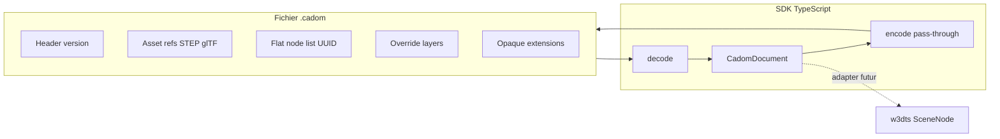

# CADOM MVP A — Spec + Protobuf + SDK TypeScript

> Bootstrap du standard CADOM dans OpenCAD : schéma Protobuf, spécification, et SDK TypeScript strict (lecture/écriture, DAG plat UUID, overrides non destructifs, extensions pass-through) conçu pour une ingestion future par w3dts — sans viewer dans ce MVP.

## Décisions figées

- **Nom** : CADOM (CAD Object Model)
- **Extension fichier** : `.cadom` (protobuf binaire)
- **MVP** : A uniquement — pas de viewer ; w3dts (`c:\Users\Cyril TARRIET\w3dts`) sera le validateur visuel plus tard
- **Alignement w3dts** : `local_transform` = mat4 column-major, 16 × `float` → `Float32Array` (même layout que gl-matrix) ; unités mètres, Y-up documentées

## Vision (rappel)

Le format délègue la géométrie pure à des fichiers externes standards (STEP, glTF) et se concentre sur la structure d’assemblage et les métadonnées. Piliers :

- Sérialisation Protobuf (typage fort, multi-langages)
- Liste plate UUID (DAG) pour assemblages massifs
- TypeScript strict + `Float32Array` pour WebGL/WebGPU
- Late-tessellation / lazy-loading du graphe puis des géométries
- Overrides non destructifs + extensions pass-through

## Architecture cible

Le format **ne contient pas** de B-Rep : uniquement structure d’assemblage + métadonnées + références géométrie externes + calques d’overrides.

## Structure du dépôt OpenCAD

Monorepo npm/pnpm minimal :

- `packages/cadom-proto` — `cadom.proto` + génération TS (`protobufjs` ou `@bufbuild/protobuf`)
- `packages/cadom` — SDK runtime (API publique)
- `documentation/specification` — spécification Markdown (v0.1)
- `fixtures` — petits `.cadom` de test + assets glTF factices
- Root : `package.json`, `pnpm-workspace.yaml`, `tsconfig`, `README`

## Schéma Protobuf (cœur)

Messages essentiels dans `cadom.proto` :

- **`CadomFile`** : `version`, `units`, `up_axis`, `root_ids[]`, `nodes[]`, `assets[]`, `overrides[]`, `extensions[]`
- **`Node`** : `id` (UUID bytes/string), `parent_id`, `name`, `local_transform` (repeated float, len 16), `asset_id` optionnel, `visible`, `semantic_type` optionnel
- **`Asset`** : `id`, `uri` (relatif ou absolu), `mime` / `kind` (`STEP` | `GLTF` | `GLB` | `OTHER`)
- **`Override`** : cible `node_id`, calque nommé ; champs patchables : `visible`, `material_ref`, `local_transform` optionnel
- **`Extension`** : `vendor` + `type` + `payload` (`bytes`) — **jamais interprété** par le core ; round-trip obligatoire

Liste plate : pas d’enfants imbriqués dans le proto ; enfants reconstruits en mémoire via map `id → Node` (O(1)).

## SDK TypeScript — API publique

Package `@opencad/cadom` (ou `cadom`) avec :

| API | Rôle |
|-----|------|
| `decode(bytes) → CadomDocument` | Parse protobuf → graphe plat + maps |
| `encode(doc) → Uint8Array` | Sérialisation ; extensions inconnues réécrites telles quelles |
| `CadomDocument` | `nodes: Map<string, CadomNode>`, `getChildren(id)`, `getWorldMatrix(id)` |
| `applyOverrides(doc, layer?)` | Vue résolue non destructive (sources intactes) |
| `registerExtension` / opaque store | Registre ; payloads non reconnus conservés en `Uint8Array` |
| Transforms | Accès `Float32Array(16)` **vues** ou copies contrôlées — pas de tableaux JS number[] au hot path |

Pas de dépendance à w3dts dans le SDK. Un type/export `CadomResolvedNode` documenté pour l’adapter futur (id, parentId, localTransform, geometryUri, visible, material…).

## Spec v0.1 (`documentation/specification/cadom-v0.1.md`)

Couvrir : identité du format, unités/axes, modèle de nœuds plat, assets externes, overrides, extensions pass-through, versioning (`major.minor`), règles de compatibilité, et notes d’intégration w3dts (mapping vers `TransformComponent` / `SceneNode`).

## Tests (sans viewer)

- Round-trip encode/decode d’un assemblage multi-niveaux
- Préservation opaque d’une extension inconnue
- Application d’overrides sans mutation des nœuds source
- Intégrité mat4 (16 floats) et résolution parent→enfant

## Hors scope MVP A (code)

- Viewer / package adapter w3dts
- Conteneur zip multi-fichiers
- Tessellation STEP, conversion géométrie
- Bindings C++/Python (le `.proto` les permettra plus tard)

## Gate specs

Native asset specs v0 are **frozen** — see [native-assets-v0-freeze.md](specification/native-assets-v0-freeze.md). SDK sprint may proceed.

## Ordre d’implémentation

1. Init monorepo + tooling protobuf
2. Écrire `cadom.proto` + générer types
3. Implémenter `CadomDocument` + decode/encode + pass-through
4. Overrides + helpers graphe/matrices
5. Spec + fixtures + tests
6. README (vision, usage SDK, lien futur w3dts)

## Todos

- [ ] Initialiser monorepo pnpm OpenCAD (workspaces, tsconfig, README)
- [ ] Écrire `cadom.proto` (File, Node, Asset, Override, Extension) et générer le code TS
- [ ] Implémenter `CadomDocument`, decode/encode, maps UUID, Float32Array transforms
- [ ] Overrides non destructifs + registre extensions pass-through opaque
- [ ] Spec v0.1, fixtures `.cadom`, tests round-trip / overrides / extensions
