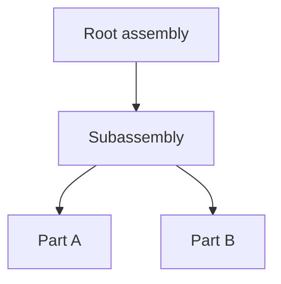

# CADOM Specification v0.1

**Status:** draft  
**File extension:** `.cadom`  
**Serialization:** Protocol Buffers (normative schema TBD — SPEC-09)  
**Language:** English (normative)

## Conventions

The key words **MUST**, **MUST NOT**, **REQUIRED**, **SHALL**, **SHALL NOT**, **SHOULD**, **SHOULD NOT**, **RECOMMENDED**, **MAY**, and **OPTIONAL** in this document are to be interpreted as described in [RFC 2119](https://datatracker.ietf.org/doc/html/rfc2119).

| Keyword | Meaning |
|---------|---------|
| **MUST** / **REQUIRED** / **SHALL** | Absolute requirement |
| **MUST NOT** / **SHALL NOT** | Absolute prohibition |
| **SHOULD** / **RECOMMENDED** | There may be valid reasons to ignore, but the full implications must be understood |
| **SHOULD NOT** | Discouraged; valid exceptions exist with care |
| **MAY** / **OPTIONAL** | Truly optional |

### Document rules

- Normative specification text **MUST** be written in **English**.
- Non-normative notes **MAY** appear in English and **MUST** be marked *Informative* (or placed under an Informative section).
- Project process docs (contribution rules, sprint notes) **MAY** remain in French; they are not part of the format contract.
- Keywords above **MUST** appear in uppercase when used with normative force.
- Examples, diagrams, and rationales are *Informative* unless explicitly labeled normative.

### Glossary (initial)

| Term | Definition |
|------|------------|
| **CADOM** | CAD Object Model — assembly orchestration document / format |
| **Node** | Flat-list entry in the assembly DAG, identified by UUID |
| **Asset** | External geometry reference (e.g. STEP, glTF, GLB) |
| **Override** | Non-destructive patch applied to a node via a named layer |
| **Extension** | Vendor payload (`vendor` + `type` + opaque `bytes`) preserved on round-trip |
| **Pass-through** | Preserve and rewrite unknown extension bytes unchanged |
| **Late tessellation** | Load the graph first; fetch / tessellate geometry asynchronously |

## Table of contents

1. [Introduction](#1-introduction) — SPEC-02
2. [Units, axes, and transforms](#2-units-axes-and-transforms) — SPEC-03
3. [Flat node model (UUID DAG)](#3-flat-node-model-uuid-dag) — SPEC-04
4. [External assets](#4-external-assets) — SPEC-05
5. [Non-destructive overrides](#5-non-destructive-overrides) — SPEC-06
6. [Pass-through extensions](#6-pass-through-extensions) — SPEC-07
7. [Versioning and compatibility](#7-versioning-and-compatibility) — SPEC-08
8. [Normative Protobuf schema](#8-normative-protobuf-schema) — SPEC-09
9. [Examples](#9-examples) — SPEC-10
10. [Informative: w3dts mapping](#10-informative-w3dts-mapping)

---

## 1. Introduction

### 1.1 Identity

**CADOM** (CAD Object Model) is a web-native **assembly orchestration** format.

A CADOM document:

- Describes an assembly as a **flat directed acyclic graph (DAG)** of nodes identified by UUIDs.
- References **external geometry** assets (for example STEP, glTF, or GLB).
- Carries **metadata**, **non-destructive overrides**, and **vendor extensions**.
- Is serialized as a **binary Protocol Buffers** payload.

The conventional file extension for a CADOM document **MUST** be `.cadom`.

CADOM **MUST NOT** be treated as a boundary-representation (B-Rep) or NURBS geometry kernel. Exact solid/surface mathematics **MUST** remain in external files or systems; CADOM orchestrates structure and metadata around them.

### 1.2 Goals

A conforming CADOM implementation **SHOULD** support the following goals:

1. **Interoperability** — Strongly typed, multi-language serialization via Protocol Buffers so CAD, web, and tooling stacks can exchange the same assembly description.
2. **Scalable structure** — Represent large assemblies as a flat UUID-addressed DAG to avoid deep recursive nesting in the on-disk form and to allow O(1) node lookup after deserialize.
3. **Web-native consumption** — Expose transforms in a layout suitable for direct use by WebGL/WebGPU clients (column-major 4×4 matrices; see §2).
4. **Late tessellation / lazy loading** — Allow consumers to load and traverse the assembly graph before asynchronously resolving external geometry.
5. **Non-destructive editing** — Express presentation and placement changes as **overrides** layered on source nodes without mutating referenced geometry files.
6. **Lossless extensibility** — Allow vendors to attach opaque extension payloads that unknown readers **MUST** preserve and rewrite unchanged (**pass-through**).

### 1.3 Non-goals

The following are **out of scope** for CADOM v0.1 (and **MUST NOT** be required of a v0.1-conformant reader or writer):

1. **Exact geometry definition** — Embedding or defining B-Rep, NURBS, or mesh tessellation payloads as the primary geometry model inside `.cadom`.
2. **Tessellation algorithms** — How STEP (or other CAD) data is converted to triangles; that remains the responsibility of the consumer or a dedicated pipeline (for example a future w3dts-based validator).
3. **Multi-file archive container** — A zip-like packaging of `.cadom` plus assets as a single compound file (may be specified in a later revision).
4. **Authoring UI or viewer runtime** — Application chrome, ECS engines, or renderers; CADOM is a document format and data contract only.
5. **Parametric feature history** — CAD feature trees, sketches, or rebuild recipes.

### 1.4 Informative comparison

*Informative.* CADOM is intentionally narrower than general 3D scene or film pipelines:

| Format | Primary focus | Relation to CADOM |
|--------|---------------|-------------------|
| **glTF** | Runtime mesh/scene delivery for real-time engines | CADOM **MAY** reference glTF/GLB as an **Asset**; CADOM does not replace glTF’s mesh/material model. |
| **USD** | Broad composed scenes, layers, and film/VFX pipelines | CADOM shares the idea of non-destructive layering but targets **CAD assembly orchestration** with Protobuf and external STEP/glTF, not a full USD-compatible scene graph. |
| **STEP (ISO 10303)** | Exact product geometry and manufacturing data | CADOM **MAY** reference STEP files as assets; it does not redefine STEP semantics. |

CADOM’s role is the **assembly graph + metadata + overrides + extensions** layer that binds those external standards for web and tooling workflows.


## 2. Units, axes, and transforms

### 2.1 Units

A CADOM document **MUST** declare a length unit for spatial data in the document header (see §8).

The default and **RECOMMENDED** unit for v0.1 **MUST** be interpreted as **metres** when the document uses the standard metres enumeration value.

Writers **SHOULD** store all linear quantities (including translation components of transforms) in the document’s declared unit. Readers that display or simulate in another unit **MUST** convert explicitly; they **MUST NOT** assume a silent unit change inside the `.cadom` payload.

### 2.2 Up axis

A CADOM document **MUST** declare an up axis in the document header.

For v0.1, conforming documents **SHOULD** use **Y-up** (positive Y points up). Readers **MUST** honor the declared `up_axis` when mapping into a runtime scene. If a reader only supports Y-up, it **MUST** either transform the scene into Y-up or fail with an explicit error; it **MUST NOT** silently ignore a non-Y-up declaration.

Right-handed coordinates are **RECOMMENDED** and assumed by the transform conventions below unless a future revision states otherwise.

### 2.3 Local transform representation

Each node **MAY** carry a local transform relative to its parent.

When present, `local_transform` **MUST** be a **4×4 matrix** stored as **exactly sixteen** IEEE-754 binary32 values (`float`), in **column-major** order:

```text
Index:  0  1  2  3  4  5  6  7  8  9 10 11 12 13 14 15
Matrix: m00 m10 m20 m30 m01 m11 m21 m31 m02 m12 m22 m32 m03 m13 m23 m33
```

This layout **MUST** match the common WebGL / gl-matrix `mat4` / `Float32Array(16)` convention (and thus w3dts `TransformComponent.localTransform`).

- Translation is in column 3: indices `12`, `13`, `14` (X, Y, Z) when using affine transforms with `m30=m31=m32=0` and `m33=1`.
- If `local_transform` is omitted, readers **MUST** treat the local transform as the **identity** matrix.

Writers **MUST NOT** emit a `local_transform` with a length other than 16. All sixteen values **MUST** be finite (not NaN or ±Infinity). Readers that encounter an invalid length or non-finite value **MUST** reject the document or the offending node with an explicit error.

### 2.4 World transform composition

Let `L(n)` be the local matrix of node `n`, and `P(n)` its parent (or null for a root).

The world matrix `W(n)` **MUST** be defined as:

- If `P(n)` is null: `W(n) = L(n)`
- Otherwise: `W(n) = W(P(n)) × L(n)` (parent world, then local), using standard column-vector matrix multiplication consistent with column-major storage.

Consumers **SHOULD** cache world matrices after a graph change. Evaluation order **MUST** be parent-before-child (topological order of the DAG).

### 2.5 Identity matrix

The identity local transform **MUST** be equivalent to:

```text
1 0 0 0
0 1 0 0
0 0 1 0
0 0 0 1
```

stored column-major as  
`[1,0,0,0, 0,1,0,0, 0,0,1,0, 0,0,0,1]`.

### 2.6 Informative: w3dts mapping

*Informative.* A future w3dts adapter **SHOULD** copy `local_transform` into `TransformComponent.localTransform` with `mat4.copy` (or equivalent) and let the engine’s transform system derive world matrices, matching glTF-style matrix ingestion rather than baking placements into mesh vertices.

## 3. Flat node model (UUID DAG)

### 3.1 Storage model

A CADOM document **MUST** store assembly structure as a **flat list** of nodes. Nested child arrays **MUST NOT** appear in the serialized form.

After deserialization, an implementation **SHOULD** build:

- a map `id → node` for O(1) lookup;
- an adjacency structure `parent_id → children[]` derived from `parent_id` fields.

### 3.2 Node identifiers

Each node **MUST** have an `id` that is a UUID string in canonical textual form (8-4-4-4-12 hexadecimal, lowercase **RECOMMENDED**).

Within a single document:

- every `id` **MUST** be unique;
- duplicate `id` values **MUST** cause the document to be rejected.

### 3.3 Node fields

A node **MUST** include the following conceptual fields (exact Protobuf encoding in §8):

| Field | Required | Description |
|-------|----------|-------------|
| `id` | yes | UUID of the node |
| `parent_id` | no | UUID of the parent; omit or null for a root candidate |
| `name` | no | Human-readable label; empty string if unknown |
| `local_transform` | no | 16 × float32 column-major mat4 (§2); identity if omitted |
| `asset_id` | no | Reference to an Asset (§4); omit if the node is structural only |
| `visible` | no | Default **SHOULD** be `true` when omitted |
| `semantic_type` | no | Optional coarse semantic tag (see §3.6) |

### 3.4 Roots and parent links

The document **MUST** provide `root_ids`: an ordered list of node ids that are assembly roots for traversal and default presentation.

Rules:

1. Every id in `root_ids` **MUST** refer to an existing node.
2. A node listed in `root_ids` **SHOULD** have no `parent_id` (or a null parent). Writers **MUST NOT** set a non-null `parent_id` on a root listed in `root_ids`.
3. If a node has a `parent_id`, that id **MUST** refer to an existing node in the same document.
4. The parent relation **MUST** form a **DAG**: cycles **MUST** be rejected.
5. Nodes unreachable from any `root_ids` entry via parent/child links **MAY** exist; conforming readers **SHOULD** still retain them on round-trip and **MAY** warn.

### 3.5 Children reconstruction

Children are not stored on the parent. A consumer **MUST** derive children as all nodes whose `parent_id` equals a given node’s `id`. Order among siblings is **not** defined in v0.1 unless a future extension specifies it; readers **MAY** sort by `name` or `id` for stable UI.

### 3.6 Semantic types

`semantic_type` is optional. When present in v0.1, writers **SHOULD** use one of:

| Value | Meaning |
|-------|---------|
| `assembly` | Grouping / product structure node |
| `part` | Leaf or part occurrence |
| `body` | Geometric body placeholder |
| `other` | Unspecified |

Unknown values **MUST** be preserved on round-trip (treat as opaque string).

### 3.7 Validation errors

A conforming reader **MUST** reject (or refuse to present as valid) a document that exhibits any of:

- duplicate node `id`;
- `parent_id` or `root_ids` entry referencing a missing node;
- a cycle in the parent relation;
- a `local_transform` that violates §2.3;
- an empty `root_ids` list when `nodes` is non-empty (**SHOULD** reject; empty document with no nodes **MAY** use empty `root_ids`).

### 3.8 Informative example

*Informative.*



Serialized as four flat nodes: Root (`parent_id` unset, in `root_ids`), Subassembly (`parent_id` = Root), Part A and Part B (`parent_id` = Subassembly).

## 4. External assets

_TBD — SPEC-05_

References to STEP / glTF / GLB (and OTHER). Lazy geometry loading; graph loads first.

## 5. Non-destructive overrides

_TBD — SPEC-06_

Layered patches (visibility, material, optional transform) without mutating source nodes.

## 6. Pass-through extensions

_TBD — SPEC-07_

Opaque `vendor` + `type` + `payload` bytes; unknown extensions MUST round-trip unchanged.

## 7. Versioning and compatibility

_TBD — SPEC-08_

## 8. Normative Protobuf schema

_TBD — SPEC-09_

## 9. Examples

_TBD — SPEC-10_

## 10. Informative: w3dts mapping

_TBD — notes for future adapter (`TransformComponent`, `SceneNode`). Not normative for the format itself.

---

## Changelog

| Version | Date | Notes |
|---------|------|-------|
| 0.1-draft | 2026-09-14 | Scaffold TOC only |
| 0.1-draft | 2026-09-14 | Conventions: English + RFC 2119; initial glossary (SPEC-01) |
| 0.1-draft | 2026-09-14 | §1 Introduction: identity, goals, non-goals (SPEC-02) |
| 0.1-draft | 2026-09-14 | §2 Units, axes, and transforms (SPEC-03) |
| 0.1-draft | 2026-09-14 | §3 Flat node model / UUID DAG (SPEC-04) |
