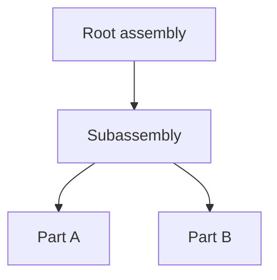

# CADOM Specification v0.3

**Status:** draft (v0.3) — extends v0.2  
**File extension:** `.cadom`  
**Serialization:** Protocol Buffers — [`packages/cadom-proto/cadom.proto`](../../packages/cadom-proto/cadom.proto)  
**Language:** English (normative)

## Conventions

The key words **MUST**, **MUST NOT**, **REQUIRED**, **SHALL**, **SHALL NOT**, **SHOULD**, **SHOULD NOT**, **RECOMMENDED**, **MAY**, and **OPTIONAL** in this document are to be interpreted as described in [RFC 2119](https://datatracker.ietf.org/doc/html/rfc2119).

| Keyword | Meaning |
|---------|---------|
| **MUST** / **REQUIRED** / **SHALL** | Absolute requirement |
| **MUST NOT** / **SHALL NOT** | Absolute prohibition |
| **SHOULD** / **RECOMMENDED** | There may be valid reasons to ignore, but the full implications must be understood |
| **SHOULD NOT** | Discouraged; valid exceptions exist with care |
| **MAY** / **OPTIONAL** | Truly optional |

### Document rules

- Normative specification text **MUST** be written in **English**.
- Non-normative notes **MAY** appear in English and **MUST** be marked *Informative* (or placed under an Informative section).
- Project process docs (contribution rules, sprint notes) **MAY** remain in French; they are not part of the format contract.
- Keywords above **MUST** appear in uppercase when used with normative force.
- Examples, diagrams, and rationales are *Informative* unless explicitly labeled normative.

### Glossary (initial)

| Term | Definition |
|------|------------|
| **CADOM** | CAD Object Model — assembly orchestration document / format |
| **Node** | Flat-list entry in the assembly DAG, identified by UUID |
| **Asset** | External geometry reference (e.g. STEP, glTF, GLB) |
| **Override** | Non-destructive patch applied to a node via a named layer |
| **Extension** | Vendor payload (`vendor` + `type` + opaque `bytes`) preserved on round-trip |
| **Pass-through** | Preserve and rewrite unknown extension bytes unchanged |
| **Late tessellation** | Load the graph first; fetch / tessellate geometry asynchronously |
| **cadomesh** | Native CADOM tessellated mesh asset (`.cadomesh`) |
| **cadompart** | Native CADOM parametric part-definition asset (`.cadompart`) |
| **cadomat** | Native CADOM PBR material asset (`.cadomat`), Khronos-aligned |
| **cadometa** | Native CADOM metadata asset (`.cadometa`) |
| **Asset binding** | Role-typed link from a Node to an Asset (mesh / parametric / material / metadata) |

## Table of contents

1. [Introduction](#1-introduction) — SPEC-02
2. [Units, axes, and transforms](#2-units-axes-and-transforms) — SPEC-03
3. [Flat node model (UUID DAG)](#3-flat-node-model-uuid-dag) — SPEC-04
4. [External assets](#4-external-assets) — SPEC-05
5. [Non-destructive overrides](#5-non-destructive-overrides) — SPEC-06
6. [Pass-through extensions](#6-pass-through-extensions) — SPEC-07
7. [Versioning and compatibility](#7-versioning-and-compatibility) — SPEC-08
8. [Normative Protobuf schema](#8-normative-protobuf-schema) — SPEC-09
9. [Examples](#9-examples) — SPEC-10
10. [Informative: w3dts mapping](#10-informative-w3dts-mapping)

---

## 1. Introduction

### 1.1 Identity

**CADOM** (CAD Object Model) is a web-native **assembly orchestration** format.

A CADOM document:

- Describes an assembly as a **flat directed acyclic graph (DAG)** of nodes identified by UUIDs.
- References **external geometry** assets (for example STEP, glTF, or GLB).
- Carries **metadata**, **non-destructive overrides**, and **vendor extensions**.
- Is serialized as a **binary Protocol Buffers** payload.

The conventional file extension for a CADOM document **MUST** be `.cadom`.

CADOM **MUST NOT** be treated as a boundary-representation (B-Rep) or NURBS geometry kernel. Exact solid/surface mathematics **MUST** remain in external files or systems; CADOM orchestrates structure and metadata around them.

### 1.2 Goals

A conforming CADOM implementation **SHOULD** support the following goals:

1. **Interoperability** — Strongly typed, multi-language serialization via Protocol Buffers so CAD, web, and tooling stacks can exchange the same assembly description.
2. **Scalable structure** — Represent large assemblies as a flat UUID-addressed DAG to avoid deep recursive nesting in the on-disk form and to allow O(1) node lookup after deserialize.
3. **Web-native consumption** — Expose transforms in a layout suitable for direct use by WebGL/WebGPU clients (column-major 4×4 matrices; see §2).
4. **Late tessellation / lazy loading** — Allow consumers to load and traverse the assembly graph before asynchronously resolving external geometry.
5. **Non-destructive editing** — Express presentation and placement changes as **overrides** layered on source nodes without mutating referenced geometry files.
6. **Lossless extensibility** — Allow vendors to attach opaque extension payloads that unknown readers **MUST** preserve and rewrite unchanged (**pass-through**).

### 1.3 Non-goals

The following are **out of scope** for CADOM v0.1 (and **MUST NOT** be required of a v0.1-conformant reader or writer):

1. **Exact geometry definition** — Embedding or defining B-Rep, NURBS, or mesh tessellation payloads as the primary geometry model inside `.cadom`.
2. **Tessellation algorithms** — How STEP (or other CAD) data is converted to triangles; that remains the responsibility of the consumer or a dedicated pipeline (for example a future w3dts-based validator).
3. **Multi-file archive container** — A zip-like packaging of `.cadom` plus assets as a single compound file (may be specified in a later revision).
4. **Authoring UI or viewer runtime** — Application chrome, ECS engines, or renderers; CADOM is a document format and data contract only.
5. **Parametric feature history** — CAD feature trees, sketches, or rebuild recipes.

### 1.4 Informative comparison

*Informative.* CADOM is intentionally narrower than general 3D scene or film pipelines:

| Format | Primary focus | Relation to CADOM |
|--------|---------------|-------------------|
| **glTF** | Runtime mesh/scene delivery for real-time engines | CADOM **MAY** reference glTF/GLB as an **Asset**; CADOM does not replace glTF’s mesh/material model. |
| **USD** | Broad composed scenes, layers, and film/VFX pipelines | CADOM shares the idea of non-destructive layering but targets **CAD assembly orchestration** with Protobuf and external STEP/glTF, not a full USD-compatible scene graph. |
| **STEP (ISO 10303)** | Exact product geometry and manufacturing data | CADOM **MAY** reference STEP files as assets; it does not redefine STEP semantics. |

CADOM’s role is the **assembly graph + metadata + overrides + extensions** layer that binds those external standards for web and tooling workflows.


## 2. Units, axes, and transforms

### 2.1 Units

A CADOM document **MUST** declare a length unit for spatial data in the document header (see §8).

The default and **RECOMMENDED** unit for v0.1 **MUST** be interpreted as **metres** when the document uses the standard metres enumeration value.

Writers **SHOULD** store all linear quantities (including translation components of transforms) in the document’s declared unit. Readers that display or simulate in another unit **MUST** convert explicitly; they **MUST NOT** assume a silent unit change inside the `.cadom` payload.

### 2.2 Up axis

A CADOM document **MUST** declare an up axis in the document header.

For v0.1, conforming documents **SHOULD** use **Y-up** (positive Y points up). Readers **MUST** honor the declared `up_axis` when mapping into a runtime scene. If a reader only supports Y-up, it **MUST** either transform the scene into Y-up or fail with an explicit error; it **MUST NOT** silently ignore a non-Y-up declaration.

Right-handed coordinates are **RECOMMENDED** and assumed by the transform conventions below unless a future revision states otherwise.

### 2.3 Local transform representation

Each node **MAY** carry a local transform relative to its parent.

When present, `local_transform` **MUST** be a **4×4 matrix** stored as **exactly sixteen** IEEE-754 binary32 values (`float`), in **column-major** order:

```text
Index:  0  1  2  3  4  5  6  7  8  9 10 11 12 13 14 15
Matrix: m00 m10 m20 m30 m01 m11 m21 m31 m02 m12 m22 m32 m03 m13 m23 m33
```

This layout **MUST** match the common WebGL / gl-matrix `mat4` / `Float32Array(16)` convention (and thus w3dts `TransformComponent.localTransform`).

- Translation is in column 3: indices `12`, `13`, `14` (X, Y, Z) when using affine transforms with `m30=m31=m32=0` and `m33=1`.
- If `local_transform` is omitted, readers **MUST** treat the local transform as the **identity** matrix.

Writers **MUST NOT** emit a `local_transform` with a length other than 16. All sixteen values **MUST** be finite (not NaN or ±Infinity). Readers that encounter an invalid length or non-finite value **MUST** reject the document or the offending node with an explicit error.

### 2.4 World transform composition

Let `L(n)` be the local matrix of node `n`, and `P(n)` its parent (or null for a root).

The world matrix `W(n)` **MUST** be defined as:

- If `P(n)` is null: `W(n) = L(n)`
- Otherwise: `W(n) = W(P(n)) × L(n)` (parent world, then local), using standard column-vector matrix multiplication consistent with column-major storage.

Consumers **SHOULD** cache world matrices after a graph change. Evaluation order **MUST** be parent-before-child (topological order of the DAG).

### 2.5 Identity matrix

The identity local transform **MUST** be equivalent to:

```text
1 0 0 0
0 1 0 0
0 0 1 0
0 0 0 1
```

stored column-major as  
`[1,0,0,0, 0,1,0,0, 0,0,1,0, 0,0,0,1]`.

### 2.6 Informative: w3dts mapping

*Informative.* A future w3dts adapter **SHOULD** copy `local_transform` into `TransformComponent.localTransform` with `mat4.copy` (or equivalent) and let the engine’s transform system derive world matrices, matching glTF-style matrix ingestion rather than baking placements into mesh vertices.

## 3. Flat node model (UUID DAG)

### 3.1 Storage model

A CADOM document **MUST** store assembly structure as a **flat list** of nodes. Nested child arrays **MUST NOT** appear in the serialized form.

After deserialization, an implementation **SHOULD** build:

- a map `id → node` for O(1) lookup;
- an adjacency structure `parent_id → children[]` derived from `parent_id` fields.

### 3.2 Node identifiers

Each node **MUST** have an `id` that is a UUID string in canonical textual form (8-4-4-4-12 hexadecimal, lowercase **RECOMMENDED**).

Within a single document:

- every `id` **MUST** be unique;
- duplicate `id` values **MUST** cause the document to be rejected.

### 3.3 Node fields

A node **MUST** include the following conceptual fields (exact Protobuf encoding in §8):

| Field | Required | Description |
|-------|----------|-------------|
| `id` | yes | UUID of the node |
| `parent_id` | no | UUID of the parent; omit or null for a root candidate |
| `name` | no | Human-readable label; empty string if unknown |
| `local_transform` | no | 16 × float32 column-major mat4 (§2); identity if omitted |
| `asset_bindings` | no | Zero or more role-typed asset links (§3.3.1); preferred in v0.3+ |
| `asset_id` | no | **Deprecated.** Legacy single reference; see §3.3.2 |
| `visible` | no | Default **SHOULD** be `true` when omitted |
| `semantic_type` | no | Optional coarse semantic tag (see §3.6) |

#### 3.3.1 Asset bindings (multi-asset)

A node **MAY** reference **multiple** assets, **at most one per role**:

| Role | Typical `Asset.kind` | Purpose |
|------|----------------------|---------|
| `MESH` | `CADOMESH`, `GLB`, `GLTF`, `STEP` | Display / tessellated or exact geometry for visualization |
| `PARAMETRIC` | `CADOMPART` | Parametric part definition |
| `MATERIAL` | `CADOMAT` | PBR material |
| `METADATA` | `CADOMETA`, `OTHER` | Structured or opaque metadata payload |

Rules:

1. Each `asset_bindings[].asset_id` **MUST** refer to an existing Asset.
2. `AssetRole` **MUST NOT** be `UNSPECIFIED` on a written binding.
3. A node **MUST NOT** contain two bindings with the same `role`.
4. Kind/role pairing **SHOULD** follow the table above; readers **MAY** warn on mismatched pairs but **MUST** still round-trip the binding.
5. Structural nodes (e.g. pure assemblies) **MAY** omit all bindings.

#### 3.3.2 Legacy `asset_id`

If `asset_id` is non-empty and the node has **no** `MESH` binding, readers **MUST** treat `asset_id` as a `MESH` binding.

Writers targeting v0.3+ **SHOULD** emit `asset_bindings` only and leave `asset_id` empty. Writers **MUST NOT** set both `asset_id` and a `MESH` binding to different asset ids.

### 3.4 Roots and parent links

The document **MUST** provide `root_ids`: an ordered list of node ids that are assembly roots for traversal and default presentation.

Rules:

1. Every id in `root_ids` **MUST** refer to an existing node.
2. A node listed in `root_ids` **SHOULD** have no `parent_id` (or a null parent). Writers **MUST NOT** set a non-null `parent_id` on a root listed in `root_ids`.
3. If a node has a `parent_id`, that id **MUST** refer to an existing node in the same document.
4. The parent relation **MUST** form a **DAG**: cycles **MUST** be rejected.
5. Nodes unreachable from any `root_ids` entry via parent/child links **MAY** exist; conforming readers **SHOULD** still retain them on round-trip and **MAY** warn.

### 3.5 Children reconstruction

Children are not stored on the parent. A consumer **MUST** derive children as all nodes whose `parent_id` equals a given node’s `id`. Order among siblings is **not** defined in v0.1 unless a future extension specifies it; readers **MAY** sort by `name` or `id` for stable UI.

### 3.6 Semantic types

`semantic_type` is optional. When present in v0.1, writers **SHOULD** use one of:

| Value | Meaning |
|-------|---------|
| `assembly` | Grouping / product structure node |
| `part` | Leaf or part occurrence |
| `body` | Geometric body placeholder |
| `other` | Unspecified |

Unknown values **MUST** be preserved on round-trip (treat as opaque string).

### 3.7 Validation errors

A conforming reader **MUST** reject (or refuse to present as valid) a document that exhibits any of:

- duplicate node `id`;
- `parent_id` or `root_ids` entry referencing a missing node;
- a cycle in the parent relation;
- a `local_transform` that violates §2.3;
- duplicate `asset_bindings` roles on the same node;
- `asset_bindings[].asset_id` or legacy `asset_id` referencing a missing Asset;
- both legacy `asset_id` and a `MESH` binding set to different ids;
- an empty `root_ids` list when `nodes` is non-empty (**SHOULD** reject; empty document with no nodes **MAY** use empty `root_ids`).

### 3.8 Informative example

*Informative.*



Serialized as four flat nodes: Root (`parent_id` unset, in `root_ids`), Subassembly (`parent_id` = Root), Part A and Part B (`parent_id` = Subassembly).

## 4. External assets

### 4.1 Role

CADOM **MUST NOT** embed primary CAD solid geometry. Geometry and companion data are referenced through **Asset** records. Nodes **MAY** bind assets via `asset_bindings` (§3.3.1), at most one asset per role (mesh, parametric, material, metadata).

### 4.2 Asset fields

Each asset **MUST** include:

| Field | Required | Description |
|-------|----------|-------------|
| `id` | yes | UUID unique within the document |
| `uri` | yes | Location of the external resource |
| `kind` | yes | One of `STEP`, `GLTF`, `GLB`, `OTHER` |
| `mime` | no | Optional MIME type hint (e.g. `model/gltf-binary`) |

Duplicate asset `id` values **MUST** be rejected.

### 4.3 URI resolution

- Absolute URIs (e.g. `https://…`, `file://…`) **MAY** be used.
- Relative URIs **MUST** be resolved against the directory containing the `.cadom` file (same rules as resolving a relative URL against a base file URL).
- Writers **SHOULD** prefer portable relative URIs for assets co-located with the document.

### 4.4 Kind semantics

| Kind | Conventional extension | Meaning |
|------|------------------------|---------|
| `STEP` | `.step` / `.stp` | ISO 10303 product data (exact geometry external to CADOM) |
| `GLTF` | `.gltf` | glTF JSON and companion resources |
| `GLB` | `.glb` | Binary glTF container |
| `CADOMESH` | `.cadomesh` | Native CADOM **tessellated mesh** (§4.8) |
| `CADOMPART` | `.cadompart` | Native CADOM **parametric** part definition (§4.9) |
| `CADOMAT` | `.cadomat` | Native CADOM **PBR material** (Khronos-aligned) (§4.10) |
| `CADOMETA` | `.cadometa` | Native CADOM **metadata** document (§4.11) |
| `OTHER` | — | Any other payload; consumers that do not recognize it **MAY** ignore load while still round-tripping the Asset record |

Parsing STEP, glTF/GLB, or native companion formats **MUST NOT** be required of a minimal CADOM graph library; loaders **MAY** live in companion packages (e.g. w3dts). A **complete** CADOM toolchain **SHOULD** understand `CADOMESH`, `CADOMPART`, `CADOMAT`, and `CADOMETA` in addition to referencing industry formats when needed.

### 4.5 Late loading

A conforming reader **MUST** be able to decode and validate the assembly graph **without** fetching asset bytes.

Geometry resolution **SHOULD** be asynchronous (**late tessellation** / lazy loading). Presentation of missing or pending assets is application-defined, but the graph structure **MUST** remain available.

### 4.6 Missing or unloadable assets

If an asset URI cannot be resolved or loaded:

- the reader **MUST NOT** corrupt or drop the Asset record or referencing nodes on a subsequent save (round-trip of metadata **MUST** remain intact);
- the reader **SHOULD** surface an explicit error or warning to the user or API caller;
- failing to render geometry **MUST NOT** by itself invalidate an otherwise conforming `.cadom` document.

### 4.7 Node–asset relationship

- Nodes bind assets through `asset_bindings` (§3.3.1), not through a single exclusive link.
- Multiple nodes **MAY** share the same Asset id (instancing).
- A node without bindings (and without legacy `asset_id`) is structural or metadata-only at the graph level.
- `Override.material_ref` **SHOULD** contain an Asset `id` of kind `CADOMAT` (and typically matches the node’s `MATERIAL` binding when both are used). When both an override material and a `MATERIAL` binding exist, the override **MUST** win for the active layer (§5).

### 4.8 Native format: cadomesh (tessellated mesh)

A **cadomesh** asset is a CADOM-native **triangle (or indexed) mesh** for display and interchange after tessellation.

- Conventional file extension: `.cadomesh`
- `Asset.kind` **MUST** be `CADOMESH`
- Payload **MUST** provide at least positions and indices suitable for GPU upload; normals and UVs **SHOULD** be included when available
- Units and up-axis of mesh data **MUST** match the referencing `.cadom` document (§2) unless the cadomesh header declares otherwise (detailed header TBD)

*Normative binary layout of `.cadomesh` **v0** is defined in [`cadomesh-v0.md`](cadomesh-v0.md) and [`packages/cadomesh-proto/cadomesh.proto`](../../packages/cadomesh-proto/cadomesh.proto).*

### 4.9 Native format: cadompart (parametric data)

A **cadompart** asset holds **parametric** part definition data (construction / feature-oriented parameters), not the assembly occurrence graph (that remains in `.cadom` nodes).

- Conventional file extension: `.cadompart`
- `Asset.kind` **MUST** be `CADOMPART`
- A part occurrence node **MAY** reference a cadompart for authoring/rebuild workflows while also referencing a cadomesh (or STEP/glTF) for visualization via a separate node or future multi-asset links

*Normative parametric schema of `.cadompart` is forthcoming. v0.2 only reserves the asset kind and role.*

### 4.10 Native format: cadomat (PBR material)

A **cadomat** asset is a CADOM-native **physically based material** description.

- Conventional file extension: `.cadomat`
- `Asset.kind` **MUST** be `CADOMAT`
- Material model **MUST** align with the Khronos **glTF 2.0 metallic-roughness PBR** material model ([glTF 2.0 materials](https://registry.khronos.org/glTF/specs/2.0/glTF-2.0.html#materials)), including base color, metallic, roughness, and optional textures as defined by that specification (and applicable Khronos extensions when explicitly versioned in the cadomat header)

*Normative `.cadomat` **v0** encoding is defined in [`cadomat-v0.md`](cadomat-v0.md) and [`packages/cadomat-proto/cadomat.proto`](../../packages/cadomat-proto/cadomat.proto). Semantics follow Khronos glTF 2.0 metallic-roughness.*

### 4.11 Native format: cadometa (metadata)

A **cadometa** asset carries **structured or opaque metadata** associated with a node occurrence (PLM attributes, custom JSON/Protobuf blobs, etc.).

- Conventional file extension: `.cadometa`
- `Asset.kind` **MUST** be `CADOMETA`
- Bound with role `METADATA`

*Normative `.cadometa` schema is forthcoming. Until then, producers **MAY** use `OTHER` with role `METADATA` for experimentation, with no interchange guarantee.*

## 5. Non-destructive overrides

### 5.1 Principle

Source nodes in the flat list are the **base** state. Presentation and placement changes **MUST** be expressible as **Override** records that do not mutate the base node fields in place when applying a view.

Writers that “bake” overrides into base nodes **MAY** do so as an authoring choice, but a conforming editor that supports layers **SHOULD** keep base nodes stable and store deltas as overrides.

### 5.2 Override fields

| Field | Required | Description |
|-------|----------|-------------|
| `node_id` | yes | Target node UUID (MUST exist) |
| `layer` | yes | Layer name (non-empty string) |
| `visible` | no | If set, replaces base visibility when the layer is active |
| `material_ref` | no | Opaque material identifier or URI string for the consumer |
| `local_transform` | no | If set, replaces base local transform when the layer is active (same §2 rules) |

An override that sets none of the optional patch fields is a no-op and **SHOULD NOT** be written.

### 5.3 Resolved view

Let `B(n)` be the base node `n`. For an ordered list of active layer names `L1…Lk`, the **resolved** node `R(n)` is computed as:

1. Start with `R ← B(n)`.
2. For each active layer name in order `L1…Lk`, apply every Override with `node_id = n` and `layer = Li`, in document order among those overrides.
3. For each applied override, each present optional field **replaces** the corresponding field in `R`.

Absent optional fields on an override **MUST NOT** clear existing values in `R` (no implicit nulling).

If no overrides apply, `R(n) = B(n)`.

### 5.4 Layer activation

Which layers are active is **not** stored inside the v0.1 document (application / session concern). Documents **MAY** define many layers; consumers **MAY** activate a subset.

When multiple overrides share the same `node_id` and `layer`, later document order **MUST** win for conflicting fields.

### 5.5 Example

*Informative.* Base node Part A is visible. An override on layer `review` sets `visible = false`. With `review` active, the resolved view hides Part A; the base node and the STEP/glTF asset files remain unchanged.

## 6. Pass-through extensions

### 6.1 Purpose

Extensions allow any vendor to attach domain data (kinematics, PMI links, R&D metadata, etc.) without requiring every reader to understand it. Unknown extensions **MUST** survive edit/save cycles (**pass-through**).

### 6.2 Extension fields

| Field | Required | Description |
|-------|----------|-------------|
| `vendor` | yes | Non-empty reverse-DNS or org id (e.g. `com.example`) |
| `type` | yes | Non-empty type id within the vendor namespace |
| `payload` | yes | Opaque bytes (may be empty only if the type defines empty as valid; writers **SHOULD** omit useless empty extensions) |

The pair `(vendor, type)` identifies the extension schema for parties that understand it. CADOM core **MUST NOT** interpret `payload`.

### 6.3 Pass-through rules (normative)

A conforming reader/writer that does not understand an extension:

1. **MUST** retain the extension in memory for the lifetime of the document session (unless the user explicitly deletes it through an API that targets that extension);
2. **MUST** write the extension back with identical `vendor`, `type`, and `payload` byte sequence on encode;
3. **MUST NOT** strip, reorder destructively relative to other unknown extensions of different identity, or re-encode payload contents;
4. **MUST NOT** fail document open solely because an extension is unknown.

Document order of extensions **SHOULD** be preserved on round-trip.

### 6.4 Naming recommendations

*Informative / RECOMMENDED.*

- Prefer `vendor` as reverse DNS (`com.company`).
- Prefer `type` as a stable, versioned token (`kinematics.v1`).
- Avoid colliding with other vendors’ namespaces.

A public registry is optional and not required for v0.1 conformance.

### 6.5 SDK compliance checklist

*Informative.* A CADOM SDK is pass-through compliant if:

- [ ] Unknown extensions are exposed as opaque blobs (or equivalent) in the object model;
- [ ] `encode(decode(bytes))` preserves unknown extension payloads bit-for-bit when the application did not mutate them;
- [ ] No core API silently drops extensions on load.

### 6.6 Example

*Informative.* Extension `vendor=com.example`, `type=kinematics.v1`, `payload=<binary joint data>`. A material-only editor opens the file, changes an override, and saves: the kinematics payload is unchanged.

## 7. Versioning and compatibility

### 7.1 Version fields

A CADOM document **MUST** declare format version integers in the header:

| Field | Meaning |
|-------|---------|
| `version_major` | Incompatible / breaking revisions |
| `version_minor` | Backward-compatible additions within a major |

For this specification revision, writers producing v0.3 documents **MUST** set `version_major = 0` and `version_minor = 3`.

- v0.2 writers: `version_minor = 2` (native kinds without multi-role bindings requirement).
- v0.1 writers: `version_minor = 1` and **MUST NOT** emit native kinds `CADOMESH` / `CADOMPART` / `CADOMAT` / `CADOMETA`.


A patch/third component is **not** required in the document header for v0.1; editorial patch notes appear in this document’s changelog only.

### 7.2 Reader compatibility

Given a document `(maj, min)` and a reader that implements specification major `Rmaj` with highest minor `Rmin`:

1. If `maj != Rmaj`, the reader **MUST** either reject the document with an explicit unsupported-version error **or** open it only behind an explicit compatibility mode that documents risk. Silent best-effort opens across major versions **MUST NOT** be the default.
2. If `maj == Rmaj` and `min <= Rmin`, the reader **MUST** accept the document (subject to other validation rules).
3. If `maj == Rmaj` and `min > Rmin`, the reader **SHOULD** accept the document when possible, ignoring unknown additive fields per §7.3, and **MAY** warn that the file is newer.

While major is `0`, breaking changes **MAY** occur with minor bumps; producers and consumers **SHOULD** treat `0.x` as unstable.

### 7.3 Unknown Protobuf fields

CADOM serialization uses Protocol Buffers. Unknown fields encountered when parsing with an older schema:

- **MUST** be preserved on round-trip when using a parser/runtime that supports unknown-field retention (aligns with extension pass-through intent);
- **MUST NOT** cause a hard failure solely for being unknown, unless the reader is running in a strict mode that the API documents.

Core libraries **SHOULD** enable unknown-field preservation by default.

### 7.4 When to bump

| Change | Bump |
|--------|------|
| Incompatible field renumbering, removed required field, changed semantics of existing field | `version_major` (+ reset minor to 0, except during `0.x` instability) |
| New optional field, new enum value with safe default, new optional message | `version_minor` |
| Spec wording / examples only | Document changelog only (no file version bump required) |

### 7.5 Spec changelog (v0.1)

See the [Changelog](#changelog) at the end of this document. Freeze of v0.1 is tracked by SPEC-11.

## 8. Normative Protobuf schema

The normative on-disk schema for CADOM v0.1 **MUST** be the Protocol Buffers definition in:

[`packages/cadom-proto/cadom.proto`](../../packages/cadom-proto/cadom.proto)

Writers **MUST** emit a serialized `cadom.v0_1.CadomFile` message as the contents of a `.cadom` file (no additional framing in v0.1).

### 8.1 Message map

| Spec concept | Proto message / enum |
|--------------|----------------------|
| Document | `CadomFile` |
| Node (§3) | `Node` |
| Asset binding (§3.3.1) | `NodeAssetBinding` + `AssetRole` |
| Asset (§4) | `Asset` + `AssetKind` |
| Override (§5) | `Override` |
| Extension (§6) | `Extension` |
| Units / up axis (§2) | `LengthUnit`, `UpAxis` |
| Version (§7) | `version_major`, `version_minor` |

### 8.2 Encoding notes

- `Node.local_transform` and `Override.local_transform` **MUST** be either empty (omitted / not applied) or contain **exactly 16** floats (column-major).
- `Node.parent_id` equal to the empty string means “unset”.
- `Node.asset_bindings` is the v0.3+ multi-asset model; `Node.asset_id` is legacy (§3.3.2).
- For `Override`, `optional` scalar fields encode presence: an unset `visible` / `material_ref` **MUST NOT** patch that property (§5.3). An empty `local_transform` list means “do not patch transform”.
- For `Node.visible`, unset **MUST** be interpreted as `true` by readers (§3.3).
- Extension `payload` **MUST** be preserved bit-for-bit on pass-through (§6).
- Field numbers in `cadom.proto` are stable; renumbering **MUST** bump the format major version (§7).

### 8.3 Informative minimal hex

*Informative.* An empty-ish valid document still requires version, units, up axis, and typically at least one root node. Concrete fixtures are provided under SPEC-10.

## 9. Examples

*Informative.* Worked examples live under [`fixtures/`](../../fixtures/):

| ID | File | Covers |
|----|------|--------|
| A | [`example-a-three-level-assembly.md`](../../fixtures/example-a-three-level-assembly.md) | Flat DAG, assets, roots |
| B | [`example-b-visibility-override.md`](../../fixtures/example-b-visibility-override.md) | Override resolution (§5) |
| C | [`example-c-passthrough-extension.md`](../../fixtures/example-c-passthrough-extension.md) | Extension pass-through (§6) |

Binary `.cadom` encodings of these examples **SHOULD** be added when the TypeScript SDK can encode them.

## 10. Informative: w3dts mapping

*Informative.* Suggested mapping for a future adapter (not required for format conformance):

| CADOM | w3dts |
|-------|--------|
| Node id | External map `CadomNodeId → Entity` / `SceneNode` |
| parent_id / children | `HierarchyComponent` / `SceneNode.add` |
| `local_transform` | `mat4.copy` into `TransformComponent.localTransform` |
| Asset URI (GLB/glTF) | `CompositeModelLoader` / GLB loader under that node |
| Asset URI (STEP) | STEP tessellation pipeline, then mesh upload |
| `visible` / layer | `RenderableComponent.visible` / `.layer` |
| `semantic_type` | `CadMetadataComponent` when applicable |
| Overrides | Apply resolved view before or while syncing ECS |

Prefer live node matrices (GLB-style) over baking placements into mesh vertices.

---

## Changelog

| Version | Date | Notes |
|---------|------|-------|
| 0.1-draft | 2026-09-14 | Scaffold TOC only |
| 0.1-draft | 2026-09-14 | Conventions: English + RFC 2119; initial glossary (SPEC-01) |
| 0.1-draft | 2026-09-14 | §1 Introduction: identity, goals, non-goals (SPEC-02) |
| 0.1-draft | 2026-09-14 | §2 Units, axes, and transforms (SPEC-03) |
| 0.1-draft | 2026-09-14 | §3 Flat node model / UUID DAG (SPEC-04) |
| 0.1-draft | 2026-09-14 | §4 External assets (SPEC-05) |
| 0.1-draft | 2026-09-14 | §5 Non-destructive overrides (SPEC-06) |
| 0.1-draft | 2026-09-14 | §6 Pass-through extensions (SPEC-07) |
| 0.1-draft | 2026-09-14 | §7 Versioning and compatibility (SPEC-08) |
| 0.1-draft | 2026-09-14 | §8 Normative Protobuf schema + cadom.proto (SPEC-09) |
| 0.1-draft | 2026-09-14 | §9 Examples + fixtures A/B/C; §10 w3dts notes (SPEC-10) |
| 0.1 | 2026-09-14 | Draft frozen (SPEC-11); `Node.visible` optional in proto |
| 0.2 | 2026-09-14 | Native assets: CADOMESH, CADOMPART, CADOMAT (#27) |
| 0.3 | 2026-09-14 | Multi-asset bindings per node + CADOMETA (#29) |
