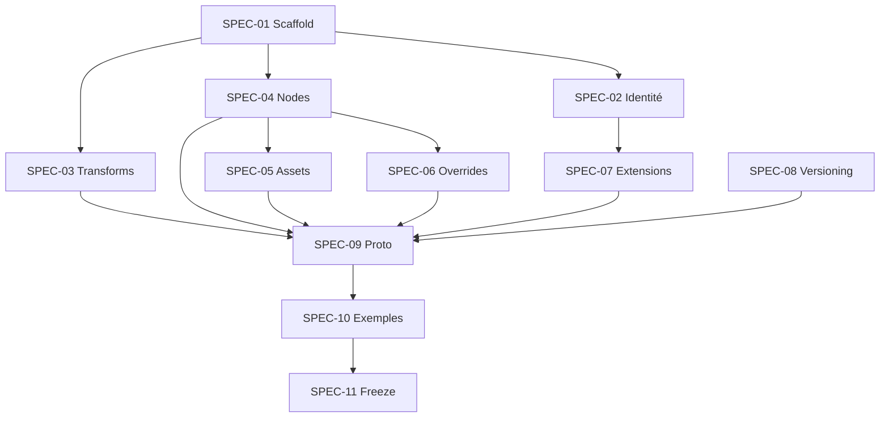

# Sprint — Écriture des spécifications CADOM v0.1

Milestone GitHub : [Sprint Spec CADOM v0.1](https://github.com/naanouff/OpenCAD/milestone/1)

Objectif du sprint : rédiger la spécification normative du format (prose + draft protobuf), **sans** implémenter le SDK.

## Backlog

| ID | Ticket | Issue |
|----|--------|-------|
| SPEC-01 | Scaffold `documentation/specification` + EN writing conventions | [#1](https://github.com/naanouff/OpenCAD/issues/1) |
| SPEC-02 | Identité, objectifs et non-objectifs | [#2](https://github.com/naanouff/OpenCAD/issues/2) |
| SPEC-03 | Unités, axes et transforms (mat4) | [#3](https://github.com/naanouff/OpenCAD/issues/3) |
| SPEC-04 | Modèle de nœuds — DAG plat à UUID | [#4](https://github.com/naanouff/OpenCAD/issues/4) |
| SPEC-05 | Assets externes (STEP, glTF, GLB) | [#5](https://github.com/naanouff/OpenCAD/issues/5) |
| SPEC-06 | Overrides non destructifs | [#6](https://github.com/naanouff/OpenCAD/issues/6) |
| SPEC-07 | Extensions pass-through | [#7](https://github.com/naanouff/OpenCAD/issues/7) |
| SPEC-08 | Versioning et compatibilité | [#8](https://github.com/naanouff/OpenCAD/issues/8) |
| SPEC-09 | Schéma Protobuf normatif (`cadom.proto`) | [#9](https://github.com/naanouff/OpenCAD/issues/9) |
| SPEC-10 | Exemples et fixtures documentés | [#10](https://github.com/naanouff/OpenCAD/issues/10) |
| SPEC-11 | Revue et freeze Spec v0.1 | [#11](https://github.com/naanouff/OpenCAD/issues/11) |

## Ordre recommandé

SPEC-02 à SPEC-08 peuvent avancer en parallèle après SPEC-01. SPEC-09 consolide le proto ; SPEC-10 illustre ; SPEC-11 fige.

## Labels

- `spec` — travail de spécification format
- `sprint-spec` — inclus dans ce sprint
- `documentation`

## Hors sprint

Implémentation monorepo, SDK TypeScript, viewer w3dts — sprints suivants (voir [plan-mvp-a-cadom.md](plan-mvp-a-cadom.md)).
