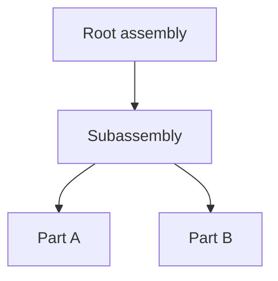

# Example A — Three-level assembly

*Informative logical document (not binary Protobuf).*



```yaml
version_major: 0
version_minor: 1
units: METRES
up_axis: Y
root_ids:
  - "11111111-1111-1111-1111-111111111111"
assets:
  - id: "aaaaaaaa-aaaa-aaaa-aaaa-aaaaaaaaaaaa"
    uri: "./part-a.glb"
    kind: GLB
  - id: "bbbbbbbb-bbbb-bbbb-bbbb-bbbbbbbbbbbb"
    uri: "./part-b.glb"
    kind: GLB
nodes:
  - id: "11111111-1111-1111-1111-111111111111"
    parent_id: ""
    name: "Root assembly"
    semantic_type: assembly
    visible: true
  - id: "22222222-2222-2222-2222-222222222222"
    parent_id: "11111111-1111-1111-1111-111111111111"
    name: "Subassembly"
    semantic_type: assembly
    visible: true
  - id: "33333333-3333-3333-3333-333333333333"
    parent_id: "22222222-2222-2222-2222-222222222222"
    name: "Part A"
    semantic_type: part
    asset_bindings:
      - role: MESH
        asset_id: "aaaaaaaa-aaaa-aaaa-aaaa-aaaaaaaaaaaa"
    visible: true
  - id: "44444444-4444-4444-4444-444444444444"
    parent_id: "22222222-2222-2222-2222-222222222222"
    name: "Part B"
    semantic_type: part
    asset_bindings:
      - role: MESH
        asset_id: "bbbbbbbb-bbbb-bbbb-bbbb-bbbbbbbbbbbb"
    visible: true
overrides: []
extensions: []
```
